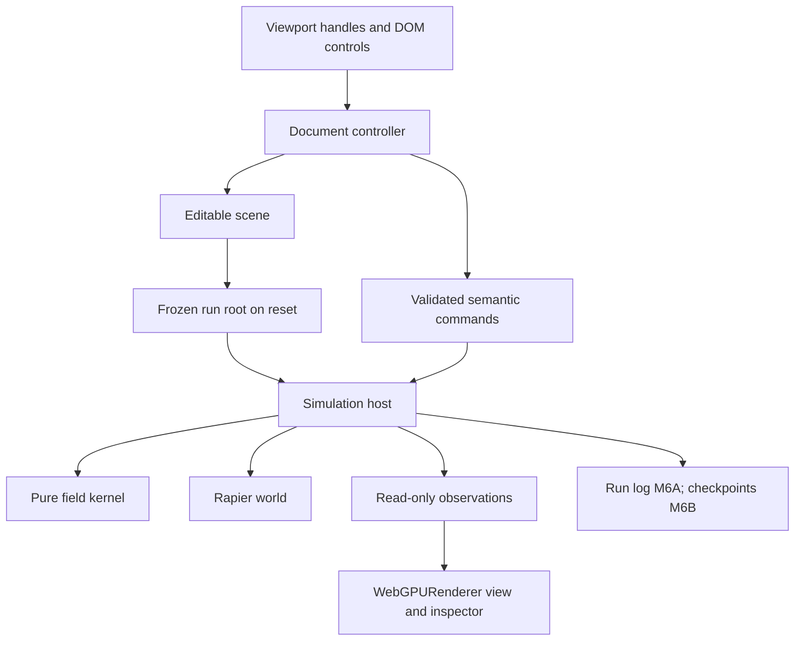
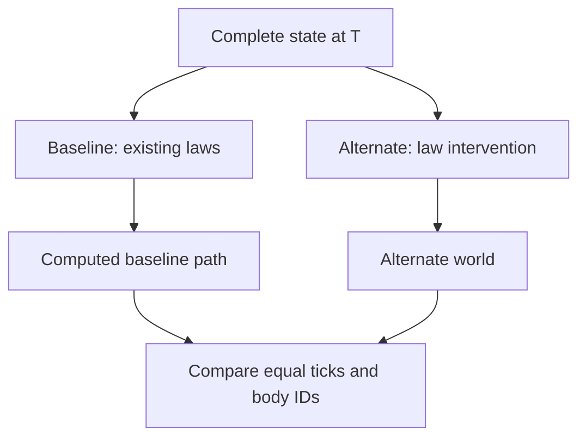

# Lawsmith — Engineering Specification

**Version:** 1.0 · **Date:** 2026-10-05 · **Status:** proposed baseline, awaiting owner review  
**Companion:** [MILESTONES.md](MILESTONES.md) · **Target:** a Tauri 2 macOS desktop application on Apple Silicon

> Grab a rule, move it through the world, and see motion change for an understandable reason.

This document defines the product and its engineering contracts. The companion defines when each contract must be implemented and the evidence needed to accept it. Neither document reports an implementation, measured performance, or completed milestone. Owner review of these documents precedes M0.

**MUST** identifies an acceptance requirement. **SHOULD** permits a documented implementation judgment. **Deferred** means agents must not build it merely because an extension point exists. Equations, numerical defaults, budgets, and interfaces below are Lawsmith design decisions unless explicitly attributed to an external source. TypeScript sketches specify boundaries; they are not a request to create a framework.

## 1. Product and reason to exist

Lawsmith is a three-dimensional computational playground in which physical laws are visible, spatially manipulable objects. It ships as `Lawsmith.app`: a Tauri 2 macOS application with a TypeScript/Three.js/WebGPU frontend in WKWebView. A user places a sideways-acceleration volume in a falling stream, turns its direction, adds a drag pocket, and discovers a new path. Later, the user combines primitives into a compound law and compares two continuations from the same world state.

The primary loop is **place → manipulate → observe → ask why → change one thing → compare**. Learning physics may result, but lessons, quizzes, and scientific validation are not the product. The viewport is an instrument for authoring behavior, not just an output monitor for an inspector.

The distinctive product bet is the combination of tactile law authoring, faithful computational visualization, and controlled alternate futures. Spatial force fields themselves are established prior art; Lawsmith makes no claim to have invented them. Blender's force-field tooling is a useful reference for this existing vocabulary.[^blender] The implementation should reuse commodity graphics and physics while concentrating original work in interaction, semantic clarity, and experiment design.

### 1.1 Nonnegotiable product contracts

| ID | Contract | Consequence |
| --- | --- | --- |
| C1 | Laws are first-class semantic objects. | A law has an identity, pose, support, behavior, and inspectable contribution independent of its mesh. |
| C2 | Spatial manipulation changes actual computation. | Translation moves support; rotation turns local behavior and support; resizing changes support without multiplying strength. |
| C3 | The first interaction is compelling early. | M1 demonstrates live bending and reset; M2 completes the defining demonstration with save/load. |
| C4 | Visual explanations are technically honest. | Distinguish acceleration, velocity, contact effects, sampled probes, recorded paths, and computed alternatives. |
| C5 | There is one simulation authority. | Only the simulation host mutates the physics world; UI and renderer submit commands or consume observations. |
| C6 | Time advances in fixed, numbered steps. | Rendering cadence, pointer frequency, and background throttling cannot change an already recorded simulation. |
| C7 | Authoring, restarting, and replay have different meanings. | Live edits cannot rewrite a run's frozen starting state or erase previously applied forces. |
| C8 | Scene artifacts preserve semantics. | Imports validate transactionally; an unsupported law is never silently omitted from a simulation. |
| C9 | Alternatives begin from the same complete state. | A baseline is actually simulated; ghosts never become colliders. |
| C10 | Complexity must buy a visible capability. | Thin Tauri shell and WebGPU graphics from the start; no initial worker, ECS, node canvas, server, arbitrary scripting, or custom field compiler. |

### 1.2 Scope by delivery stage

| Stage | Included result |
| --- | --- |
| Interactive proof, M0–M1 | Qualified native launch, falling bodies, a box-shaped directional law, truthful arrows, direct transforms, play/pause/reset. |
| Portable V0, M2 | The complete ten-step defining demo, explicit scene files, recoverable authoring with undo/redo. |
| Creative core, M3–M5 | Four primitive laws, three analytic support shapes, useful probes/trails, and bounded compound laws. |
| Reproducible experiments, M6A–M8 | Exact linear recording/replay in M6A; checkpoints/seek in M6B; one baseline/alternate comparison in M7; inviting examples and refined controls in M8. |
| Flagship candidate, M9–M10 | A measured operating envelope, complete verification, documentation and real demonstration assets. |

The project remains useful if it stops after M2 or M5. A flagship release includes branching futures. The plan has **12 gates: M0, M1, M2, M3, M4, M5, M6A, M6B, M7, M8, M9, M10**. Every stage uses the WebGPU-first graphics architecture; advanced GPU field evaluation and simulation are separate, conditional capabilities.

## 2. The defining demonstration and first implementation session

### 2.1 Exact demonstration contract

The full demonstration MUST show, in one understandable workflow:

1. A stream with roughly 20–100 visible bodies falling under ambient gravity.
2. A selectable translucent box representing a directional acceleration law.
3. The user translating that box from outside the stream into it.
4. Bodies bending sideways while their centers are inside the law's support.
5. The user rotating the law and observing a corresponding change in subsequent motion.
6. Sparse arrows that reflect the evaluator's direction and boundary attenuation.
7. A body leaving the support retaining its acquired velocity.
8. Disabling the law removing its contribution.
9. Resetting a fixed authored configuration and reproducing its motion.
10. Saving and reopening that configuration and reproducing its functional behavior.

M1 covers steps 1–9. **M2 is the first milestone allowed to claim the complete defining demonstration.** Reset in M1 restarts the current law configuration; it does not reenact a person's earlier drag. Recording that drag and replaying it from its frozen root arrives in M6A; arbitrary seeking arrives in M6B.

### 2.2 Starting recipe

Use these concrete values to avoid another design session before the first demo. The camera and colors may be adjusted for legibility without changing the numerical fixtures.

| Item | Initial value |
| --- | --- |
| Coordinates and units | Right-handed, +Y up; meters, seconds, kilograms; quaternion order `[x,y,z,w]`. |
| Simulation step | `h = 1/120 s`; integer tick starts at zero. |
| Scene/emitter seed | Nonzero uint32 `0x4c415731`, explicitly persisted in both definitions. |
| Ambient acceleration | `[0,-9.81,0] m/s²`, supplied through the Lawsmith force adapter. |
| Floor | Fixed cuboid centered at `[0,-2.1,0]`, half-extents `[20,0.1,20]`; top at `y=-2`. |
| Stream | One sphere every 8 ticks, starting at tick 0; lifetime 512 ticks, giving at most 64 live emitted bodies. |
| Sphere | Radius `0.08 m`, mass `1 kg`, initial velocity `[0,-0.5,0]`; restitution `0.25`, friction `0.6`. |
| Spawn position | `[0,6,0]` plus seeded X/Z offsets in `[-0.25,0.25]`; no Y jitter. |
| Collision mode | Emitted bodies collide with the floor, not one another, in this explanatory recipe. M3 adds an all-body collision example. |
| Directional law | Initial center `[3,1,0]`, identity rotation, box half-extents `[1.5,2,1.5]`, local direction `[1,0,0]`, strength `12 m/s²`. |
| Boundary fade | Inner fade fraction `0.25`, as defined in §7. |
| Initial view | Perspective camera approximately `[9,7,11]`, looking at `[0,1,0]`; visible field handle and emitter. |

The user first moves the law toward `[0,1,0]`. Translation into the stream must be possible immediately, without opening an inspector. Rotation and extent modes may use Three.js TransformControls in M1; a separate strength handle arrives in M3.

### 2.3 Protecting the first night

M0 establishes only the minimal Tauri launch/package path, full-window macOS surface, real WKWebView/WebGPU rendering, basic window interaction, and dependency initialization. It qualifies the runtime and then stops. Native file workflows begin in M2; menus, persistence, settings, automation infrastructure and distribution engineering do not precede M1. In M1, implement the stream and constant field before save formats, history UI, generic registries, custom compute kernels, or elaborate styling. Simple node materials and small TSL visual expressions are appropriate immediately. The first local success is **a visible trajectory change caused by a dragged law**. Tests and a short recording finish the gate; a generalized application framework does not precede the interaction.

M0 and the first working M1 slice are intended to fit one focused evening. This is a sequencing constraint, not a guaranteed duration. If shell/setup consumes the session, simplify incidental shell work so M1 can begin immediately after qualification. A genuine blocking runtime incompatibility follows §3.3's bounded investigation and owner-replan gate; simplifying scope never means accepting a different graphics backend or silently changing shells.

## 3. Selected technology and application boundary

| Area | Selection | Reason and boundary |
| --- | --- | --- |
| Application shell | Tauri 2, one native macOS window, WKWebView, Apple Silicon. | Package a real `.app`; keep Rust limited to required window, lifecycle and document I/O integration. |
| Language/build | TypeScript in strict mode, Vite, npm lockfile; pinned Rust toolchain and Cargo.lock. | Frontend assets are bundled into the Tauri application; Vite's server is a development convenience. |
| Rendering | Modern Three.js `WebGPURenderer` with WebGPU as the primary backend. | Native destination for graphics now and GPU compute later; reuse scene, camera, picking, instancing and node materials. |
| GPU authoring | TSL and the Three.js node system by default; generated WGSL on WebGPU. | Use raw WGSL only for a demonstrated requirement that TSL cannot cleanly satisfy. |
| Physics | `@dimforge/rapier3d-compat`, initialized asynchronously once. | Reuse rigid-body integration and collisions; the compatibility package avoids initial WASM bundler plumbing. |
| Fields | Pure CPU TypeScript kernel, called by the simulation host. | Small body counts, testable equations, shared explanations, no GPU readback dependency. |
| Authority | One main-thread `SimulationHost` initially. | Shortest route to low-latency manipulation and debuggable ordering. |
| Editor UI | Small TypeScript/DOM components and an explicit document controller. | No Redux, ECS, service locator, or new general state-management library. Framework migration needs an actual maintenance problem. |
| Tests | Vitest for domain/integration fixtures; optional frontend browser harnesses; actual Tauri smoke/integration/visual QA. | macOS native automation may use the qualified test-only route in §17.3. The packaged app is the release authority. |
| Persistence | Native open/save dialogs and bounded document I/O; application-local recovery files from M2. | Frontend-owned JSON semantics; narrow native filesystem operations; no account, cloud, runtime API key, or server. |

Three.js documents WebGPURenderer as selecting WebGPU when supported, with an internal WebGL 2 backend available for compatibility.[^webgpu-api] TransformControls provides translation, rotation, scale, local/world modes, and change events suitable for the initial handles.[^transforms] Rapier's compatibility package embeds its WASM payload and uses asynchronous initialization.[^rapier-start]

The Three.js baseline is **r183 or newer**, using its modern renderer architecture and current APIs. Resolve, smoke-test, and lock a concrete compatible release in M0, together with Tauri 2, its API/CLI, transitive WRY/runtime dependencies and Rapier. Record Node/npm, Rust, macOS SDK/Xcode command-line tools, target architecture and both lockfiles; this specification does not invent a future lockfile or prescribe an unverified “latest” release. Engine upgrades create a new simulation compatibility identity and require relevant replay checks. Native/runtime changes are also assessed against §13.1.

Tauri is the selected shell. The simulation host, field semantics, authoring model, Three.js scene and ordinary UI remain frontend-owned. Rust does not acquire a second physics loop, field evaluator, document model or generic service layer. Use only native capabilities required by an accepted workflow; do not implement an Electron variant or a generic shell abstraction.

| Execution context | Purpose | Acceptance authority |
| --- | --- | --- |
| Browser or headless frontend harness | Fast domain tests, DOM workflows, isolated graphics debugging; native operations may be mocked explicitly. | Supporting evidence only; cannot qualify native rendering, dialogs, window behavior or exact application replay. |
| Tauri development app | Actual WKWebView/window behavior while Vite supplies frontend assets. | Required M0 runtime smoke; useful ongoing integration evidence. |
| Packaged production `Lawsmith.app` | Bundled assets, actual shipped shell/runtime and desktop workflows. | Authoritative M0 package smoke and final M10 release qualification. |

Initial support is macOS on the owner's qualified Apple Silicon environment. Safari.app, Chrome, headless WebKit, Windows and Linux are not release targets. A cheap browser smoke test may be informational; no browser result substitutes for the Tauri app or blocks M10 solely because that browser is unsupported.

### 3.1 WebGPU-first graphics and TSL policy

Use `WebGPURenderer` from M0, with modern `three/webgpu`, `three/tsl`, and compatible addon entry points from the same pinned Three.js installation. Initialize the renderer asynchronously before rendering; coordinate its animation loop with the fixed-step host. Detect and record the actual backend after initialization so an automatic compatibility fallback cannot be mistaken for WebGPU qualification. Current Three.js guidance describes the modern import, asynchronous setup, node material and postprocessing approach.[^webgpu]

Use compatible built-in node materials for the first floor, bodies, support shells and arrows. When custom GPU visual logic is useful, author it in **TSL**, including later compute where practical. TSL is a JavaScript-facing node authoring layer whose backend builders generate shader code; its authoring language is not the shader language executed by the device.[^tsl] The WebGPU backend consumes WGSL. A renderer-provided WebGL 2 fallback uses GLSL where the requested nodes/capabilities are supported. Lawsmith does not maintain hand-written GLSL equivalents or a second WebGLRenderer implementation.

The policy is **TSL by default; raw WGSL when a measured capability or performance need justifies lower-level control**. A raw-WGSL addition must identify the workload, limitation or overhead of the TSL approach, required memory layout/workgroup/storage-buffer behavior, correctness tests, and measured benefit. Use the narrowest integration the pinned renderer supports. Do not introduce direct GPU-device ownership or a separate rendering engine merely to use an escape hatch.

WebGL 2 is optional compatibility through the same modern renderer, not a co-equal architecture or a reason to constrain the primary feature set. Where that fallback can run a supported subset, identify it as compatibility mode and test only the subset actually offered. It never satisfies the native WebGPU gate. If the primary backend is unavailable, report the failure and retain already implemented document/save access; M0 needs only a readable diagnostic. There is no requirement to recreate a WebGPU feature in legacy GLSL or add another renderer to preserve compatibility.

M1 still evaluates fields and simulates rigid bodies on CPU/WASM. WebGPU renders those results immediately. Sparse arrows can be CPU-sampled and displayed through node materials; this does not require a second field evaluator. No Lawsmith-owned field/shader compiler, GPU physics, custom storage allocator, or dense compute subsystem is required in V0.

### 3.2 Simulation execution and later compute

Keep the host's inputs and outputs as plain semantic data so it can move into a dedicated worker later. Do not implement transport abstractions, SharedArrayBuffer, cross-origin isolation, OffscreenCanvas, or a second scheduler in V0. A worker is admitted in M9 only if measured simulation work blocks interaction after simple CPU fixes.

When dense field evaluation, high-count probes, trajectory buffers or other GPU workloads become useful, their native target is WebGPU through TSL, with the measured raw-WGSL escape hatch above. The field representation must support a later CPU target and GPU target from common normalized semantics (§8). Advanced compute is conditional; the WebGPU renderer is already present and there is no renderer-migration milestone. Rapier/WASM remains authoritative for collision-bearing bodies in this release.

Vite remains the frontend development/build tool. Configure Tauri's development URL separately from a local `frontendDist` directory whose built assets are embedded in the application. The production path must not point at a remote site or require a localhost server.[^tauri-vite] Bundle required scripts, WASM, fonts and examples; after installation, core use requires no external network connection, account, secret or cloud endpoint. Produce the native Apple Silicon `.app` bundle; a universal binary, DMG installer, signing/notarization for distribution, updater and public publication are separate owner decisions unless a minimal local execution step actually requires one.[^tauri-bundle]

### 3.3 Qualify the actual Tauri/WKWebView stack in M0

WebKit documents WebGPU in the Safari 26 generation and its mapping to Metal, including Three.js use.[^webkit-webgpu] That establishes a current technology basis, not a qualification of Lawsmith's WKWebView, origin, dependency build or target Mac. Record the owner's installed macOS/runtime and prove the path in the app. Do not infer a minimum supported WKWebView solely from a Safari version, spoof a user agent, enable private WebKit feature flags, or require a browser test to pass first.

M0 must exercise a real spatial scene in **both the Tauri development app and the packaged production app**, on the owner's Mac. It must show a normal node material with a small TSL expression, a camera, a visible spatial frame and a temporary TransformControls target. Demonstrate translation/rotation, resize and Retina/DPR behavior, responsive frame pacing, natural native window dragging and working traffic lights. The target is only a smoke object; no field or simulation framework is needed. Rapier/WASM must initialize before use, and the packaged app must render with the development server stopped and the network disconnected.

After `await renderer.init()`, inspect the renderer's **actual selected backend**, not just `navigator.gpu` or an independently requested adapter. In r183, the diagnostic can read `renderer.backend.isWebGPUBackend === true`, corroborated by the public `renderer.coordinateSystem === THREE.WebGPUCoordinateSystem`; record whether a WebGL backend was selected. `renderer.isWebGPURenderer` identifies the class even when it falls back and is not sufficient. Verify backend-specific names against the pinned implementation and isolate them in diagnostics, outside field semantics. An unknown flag/API is unresolved evidence, not a pass. Confirm successful material/pipeline compilation and real rendered frames without GPU validation errors; API exposure alone is insufficient.[^three-backend]

Where the pinned implementation exposes a WebGPU feature-level `compatibilityMode`, record it and effective antialiasing samples separately. This is still WebGPU and must not be confused with the WebGL 2 backend fallback; it can qualify if the required scene and operations pass. There is no assumed public `renderer.getDevice()` API and no requirement for a second device or raw WGSL merely to identify the backend.[^three-backend]

The compact qualification record contains app build and dev/package mode, dependency/runtime identity (§13.1), actual document URL/origin and `isSecureContext`, renderer/backend result, exposed adapter/features where obtainable, initialization/validation errors, viewport/DPR and one real app capture. WebGPU is a secure-context API; checking the production asset origin separately matters.[^webgpu-secure] Tauri's `useHttpsScheme` setting applies to Windows/Android, so it is not a macOS origin remedy.[^tauri-window] An empty or privacy-limited adapter description may be recorded as unavailable; do not fabricate a Metal device identity or create a second GPU device just for the report.

If the actual WKWebView path fails, make one minimal reproduction, check the locked versions, asset origin and supported configuration, and try a targeted documented correction followed by dev/package retests. Timebox additional compatibility investigation to one focused setup session, normally at most two hours after prerequisites are ready. If the required path remains blocked, mark **M0 BLOCKED**, preserve valid frontend work and record the exact environment, errors, reproduction and attempted corrections for owner replan. Missing access to the target Mac leaves the gate pending. Electron/Chromium is only a possible later owner-approved contingency; this plan neither implements it nor permits a silent shell change. Do not replace the gate with WebGL compatibility or let open-ended native work postpone M1.

## 4. Architecture and ownership



These are ownership boundaries, not services or independently deployed packages. A handful of frontend modules is sufficient initially. The thin native shell provides window/lifecycle signals and, from M2, document I/O; it does not own another simulation authority.

| State | Owner | Contains | Must not contain |
| --- | --- | --- | --- |
| Editable scene | Document controller | Authored bodies/emitters/laws, initial conditions, simulation settings. | Mutable engine objects. |
| Run root | Simulation host | Frozen semantic scene, exact compatibility identity, initial seed. | References back into the live draft. |
| Active simulation | Simulation host | Rapier world, active laws, tick, emitter state, identity maps, lifetimes. | Camera or UI selection as implicit inputs. |
| Runtime/transient | Host or editor, explicitly | Pending commands, gesture state, seek cancellation, diagnostics. | Hidden effects on replay. |
| Render state | Renderer | Meshes, buffers, interpolation, field geometry, trace caches. | Authoritative body transforms. |
| UI state | Editor | Camera, hover, selection, focused control, visualization mode. | Force contributions unless routed through a semantic command. |
| Author undo | Document controller | Before/after semantic transactions; one entry per gesture. | A claim that undo rewinds physics. |
| Replay history | Run recorder | Frozen root, consumed command sequence, optional checkpoint caches. | Raw mouse events as replay inputs. |
| Native I/O state | Thin document-I/O helper | Session-local dialog-selected destinations, in-flight writes and recovery-file ordering. | Law semantics, physics state or paths treated as serialized scene authority. |

Only `SimulationHost` may create, remove, step, restore, or modify a Rapier world. Mesh transforms never become physics state by accident. Code that knows Three.js object identities must not be imported by the field kernel.

An initial module layout can be `domain`, `fields`, `simulation`, `interaction`, `rendering`, `persistence`, and `ui`, introduced as needed. Do not create empty extension modules ahead of their milestone.

## 5. Semantic document and entity model

### 5.1 Document boundary

```typescript
type Vec3 = readonly [number, number, number];
type Quat = readonly [number, number, number, number]; // x, y, z, w
type EntityId = string;
interface Pose { position: Vec3; rotation: Quat }

interface SceneDocument {
  format: "lawsmith.scene";
  schemaVersion: number;
  requiredCapabilities: readonly string[];
  semantic: {
    units: "m-kg-s";
    seed: number; // uint32, nonzero
    simulation: SimulationSettings;
    bodies: readonly BodyDefinition[];
    emitters: readonly EmitterDefinition[];
    fields: readonly FieldDefinition[];
  };
  presentation: ScenePresentation;
  metadata: { title: string; description?: string };
}

interface SimulationSettings {
  profile: string; // versioned, resolved engine/kernel settings
  stepNumerator: 1;
  stepDenominator: 120;
  ambientAcceleration: Vec3;
  maxAppliedAcceleration: number; // finite 1–200 m/s²; default 200
  maxLiveBodies: number; // default 256; import hard limit 512
}
```

`ScenePresentation` stores optional camera framing, law colors, visualization defaults, and annotations. Selection, hover, in-progress gestures, performance measurements, wall-clock dates, and engine handles are not semantic state. Changing presentation MUST leave the semantic digest and headless run unchanged.

The simulation profile resolves the precise Rapier/WASM artifact, field-kernel version, step/solver settings, collision policy mapping, and command semantics. Keep a shipped profile record in the application; do not create a remote profile service. Scene import checks that its referenced profile is available. An unavailable profile can be opened only as an explicitly converted new scene under the current profile, never as a verified continuation.

M1 uses the same conceptual state separation with a small typed in-memory recipe. M2 formalizes the file schema. Do not build the full serializer before the first field bends the stream.

### 5.2 Bodies

```typescript
type ColliderShape =
  | { kind: "sphere"; radius: number }
  | { kind: "box"; halfExtents: Vec3 };

interface BodyCommon {
  id: EntityId;
  initialPose: Pose;
  initialLinearVelocity: Vec3;
  initialAngularVelocity: Vec3;
  collider: ColliderShape;
  material: { friction: number; restitution: number };
  collisionMode: "all" | "fixedOnly";
}
type BodyDefinition = BodyCommon & (
  | { type: "dynamic"; massKg: number }
  | { type: "fixed" }
);
```

Only dynamic bodies have a finite positive authored mass. Fixed bodies require zero initial linear/angular velocity. One centered collider per body is enough through the flagship. Local center of mass is the body origin. Fields act at its world center of mass and produce no torque. Body orientation and angular velocity remain meaningful because contacts can rotate bodies.

For dynamic bodies, set collider mass properties so total mass equals `massKg`, then use the actual engine-reported mass when converting acceleration to force. Do not add a full explicit body mass on top of an already massive collider. Rapier documents collider contributions to mass/inertia and distinguishes dynamic, fixed, and kinematic behavior.[^rapier-bodies]

Kinematic bodies, arbitrary meshes, compound colliders, joints, and force-at-surface integration are deferred. Editing an authored body's geometry, mass, starting pose, or emitter definition requires a reset; the UI must make that reset explicit. V0 does not teleport a live dynamic body as a side effect of moving its mesh.

### 5.3 Emitters and stable identity

An emitter has a stable ID, pose, dynamic-body template, nonzero uint32 seed, integer `startTick`, positive integer `intervalTicks`, positive `lifetimeTicks`, optional finite `emissionCount`, and X/Y/Z jitter extents. Templates cannot embed another emitter. Tick/ordinal/count values are nonnegative safe integers, with positive intervals/lifetimes; reject additions that exceed the safe-integer range. Emitted identity is `(emitterId, spawnOrdinal)`, serialized as a stable string; Rapier handles are runtime mappings, not user identities. Authored IDs use ASCII letters/digits/underscore/hyphen, with reserved generated-ID separators; sort them by code-unit order, not locale-sensitive collation.

At boundary tick `n`, expire bodies with `deathTick <= n`, then process due emissions by emitter ID. A body spawned at `n` with lifetime `L` has `deathTick = n+L` and participates in exactly L subsequent transitions unless an explicit scene rule removes it. Initial authored bodies have no implicit lifetime.

The initial PRNG is versioned `xorshift32-v1`: a nonzero uint32 state; apply XOR with state shifted left 13, unsigned right 17, and left 5, with uint32 truncation after each operation; return `state / 2^32`. Each emitter owns a separate stream. Consume exactly three values per scheduled birth for X/Y/Z, even when a jitter extent is zero or capacity prevents the spawn. Increment the ordinal for every scheduled birth. This fixes call order and makes branching identities interpretable.

The document seed is the explicit default for newly created emitter seeds. Newly created IDs and resolved seeds are included in the creation command; replay never regenerates them. Loading does not generate new IDs or random defaults. Rendering/tracer randomness uses separate streams and cannot consume an emitter's PRNG.

The live-body limit counts all living dynamic bodies, including authored and emitted bodies; fixed colliders and probes are separate. Reject an initial scene whose authored dynamic population already exceeds it. If the limit is reached, skip that scheduled birth, retain its consumed ordinal/PRNG progression, and increment a visible diagnostic. Do not silently delete an unrelated body to make room. Acceptance scenes are configured to avoid this condition. Different branch lifetimes can legitimately produce different body presence; comparison matches IDs and shows absence rather than inventing a correspondence.

### 5.4 Laws

```typescript
type RegionDefinition =
  | { kind: "box"; halfExtents: Vec3 }
  | { kind: "sphere"; radius: number }
  | { kind: "cylinderY"; radius: number; halfHeight: number };

interface FieldDefinition {
  id: EntityId;
  enabled: boolean;
  pose: Pose;
  region: RegionDefinition;
  edgeFade: number; // fraction in [0,1]
  expression: FieldExpression;
}
```

A field pose contains translation and rotation, never an ambiguous general affine scale. Shape dimensions encode extent in meters. Box faces resize independently; sphere resizing stays uniform; cylinder resizing exposes radial and axial handles. Negative scale, reflection, and shear are unsupported. No scaling operation modifies primitive acceleration, drag coefficient, or core radius.

Law names, colors, labels, wireframe opacity, arrow density, and whether a law is visually hidden live in presentation state indexed by ID. `enabled` is semantic. Hiding its geometry does not disable its effect. The law list must distinguish these states.

## 6. Field model: a small composable acceleration vocabulary

### 6.1 Affine acceleration contract

Every supported continuous law produces a pair:

\[
E(x,n)=(A(x,n),K(x,n)),\qquad a(x,v,n)=A(x,n)-K(x,n)v.
\]

`A` is drive acceleration in m/s²; `K` is a nonnegative isotropic linear-drag coefficient in s⁻¹. `x` and `v` are the body's start-of-step center and velocity, and `n` is an integer tick. This deliberately small vocabulary supports directional acceleration, radial pull, swirl, drag, masking, and positive gain while allowing stable drag composition. It is not a general solver for arbitrary differential equations.

All field results are computed from the same start-of-step state. No field may mutate a body before another field is evaluated. The outer support weight multiplies **both** A and K. Disabled fields return exact zeros. Ambient gravity is an explicit additional drive contribution, outside local support masks.

### 6.2 Primitive equations and defaults

Let `r` be the sample position in the field's unscaled local frame, `u=[0,1,0]`, `rho = r - u(u·r)`, and `epsilon > 0` a core radius in meters. Rotate local drive results into world space using the field quaternion. K is unchanged by rotation.

| Primitive | Local evaluator before outer support | Initial parameters and interpretation |
| --- | --- | --- |
| Directional | `A = strength * direction`, `K = 0` | Unit local direction, strength `12 m/s²`; rotating the field rotates the direction. |
| Soft radial | `A = -strength * r / sqrt(dot(r,r)+epsilon²)`, `K = 0` | Strength `8 m/s²`, core `0.25 m`; positive attracts, negative repels. Exactly zero at center. |
| Vortex | `A = strength * cross(u,rho) / sqrt(dot(rho,rho)+epsilon²)`, `K = 0` | Strength `8 m/s²`, core `0.25 m`; signed strength changes circulation. Exactly zero on the axis. |
| Linear drag | `A = [0,0,0]`, `K = coefficient` | Coefficient `2 s⁻¹`; resistance is relative to the stationary world. |

Directional is M1. The other three primitives and sphere/cylinder support arrive in M3. The radial law is intentionally a **soft radial acceleration**, not Newtonian inverse-square gravity. Its core softens the central direction singularity; the region fade determines where it ends. A physically dimensioned softened inverse-square law can be a later, separately named primitive with its own tests. Do not substitute it for this equation while retaining the same schema kind.

The vortex applies tangential acceleration. It does not automatically confine bodies to circular orbits or model a fluid. Pairing it with radial pull and drag is a useful experiment. Moving a drag volume changes where it acts; it does not create a moving fluid reference frame.

### 6.3 Bounded composition

Across separate fields, contributions are additive from the beginning. A list reorder cannot change priority, because there is no priority mode. Evaluate fields in ascending stable ID order, independent of UI order.

M5 introduces a small tree inside one manipulable law:

```typescript
type Primitive =
  | { kind: "directional"; direction: Vec3; strength: number }
  | { kind: "softRadial"; strength: number; coreRadius: number }
  | { kind: "vortexY"; strength: number; coreRadius: number }
  | { kind: "linearDrag"; coefficient: number };

type Gain =
  | { kind: "constant"; value: number }
  | { kind: "triangle"; min: number; max: number;
      periodTicks: number; phaseTicks: number };

type FieldExpression = Primitive
  | { kind: "sum"; terms: readonly FieldExpression[] }
  | { kind: "gain"; gain: Gain; child: FieldExpression }
  | { kind: "mask"; pose: Pose; region: RegionDefinition;
      edgeFade: number; child: FieldExpression };
```

The initial scene schema accepts primitive leaves only. Capability identifiers admit later operators without pretending older builds support them.

Composition rules are exact:

- `sum` adds A vectors and K scalars, left to right in the stored child order. Use a nonempty array; do not reassociate floating-point sums during optimization without qualification.
- `gain` multiplies both A and K by a finite nonnegative scalar. Negative general gain is unsupported because it would turn drag into energy injection; radial and vortex reversal are signed leaf parameters.
- `mask` multiplies both outputs by its region weight. Its pose describes the mask relative to the containing field frame; it changes only the sampled support, **not the child's vector frame**.
- All primitives in a compound law share that law's origin and orientation. The outer law's region is applied once after evaluating the tree; nested masks multiply it.
- Triangle gain uses `q = ((n + phaseTicks) mod periodTicks) / periodTicks` and `g = min + (max-min)*(1-abs(2*q-1))`. The period is an integer at least 2; phase is an integer in `[0,periodTicks)`, and `0 <= min <= max`. Time comes only from n, with no wall-clock phase.

The M5 editor is a compact list of ingredients with gains and optional masks. It does not need a node canvas. It can construct a “storm bottle” from radial pull, vortex, and drag. M5 does not promise to merge arbitrarily transformed existing laws losslessly; that would need a future explicit transform operator. No expression references another field by ID, so cycles and cross-field dependency scheduling are absent.

Deferred operators include field-reference graphs, general transforms, priority, conditional predicates, replacement gravity, signed modulation, vector products, arbitrary clamps, scripting, and GPU code generation. The AST leaves room for new tagged nodes; none must be implemented speculatively.

## 7. Spatial support and boundary semantics

For a field pose with translation p and unit rotation R, compute local coordinates `r = transpose(R) * (x-p)`. Define a dimensionless shape gauge d:

| Region | Gauge d |
| --- | --- |
| Box, half-extents b | `max(abs(rx)/bx, abs(ry)/by, abs(rz)/bz)` |
| Sphere, radius s | `length(r)/s` |
| Y cylinder, radius s and half-height H | `max(sqrt(rx²+rz²)/s, abs(ry)/H)` |

These are normalized analytic gauges, **not signed-distance functions**. The resulting fade is a relative band inside the shape and is not a constant Euclidean thickness near every corner. An SDF region would be a separate future region kind.

For fade fraction f:

- If `f=0`, weight is 1 when `d<=1`, otherwise 0. This is an explicitly hard boundary.
- If `f>0`, let `z=clamp((1-d)/f,0,1)` and `weight=z*z*(3-2*z)`.
- Thus a soft region is fully active for `d<=1-f`, fades inside its outer boundary, and contributes zero for `d>=1`.

At `f=0.25`, weights at `d=0.75`, `0.875`, and `1` are exactly 1, 0.5, and 0 before floating-point tolerance. Render the outer support and, for a selected law, the inner full-strength surface. The falloff handle changes f and visibly moves that inner surface.

Support is sampled once per fixed step at each center of mass. It is not based on collider-overlap events, rendered transparency, mesh bounds, or the fraction of a body's surface inside the region. A large body's center can remain outside while part of its mesh intersects the volume; the inspector must make the center sampling rule discoverable.

Fast bodies can cross a narrow region between two samples and receive no contribution. Rigid-body CCD addresses contacts, not this field-sampling problem. V0 accepts this discrete model and uses generous support widths. By M3, an inspector diagnostic compares one-step travel with a conservative fade-band scale: `f*min(halfExtents)` for a box, `f*radius` for a sphere, or `f*min(radius,halfHeight)` for a cylinder. This is a heuristic under normalized gauges, not a continuous-crossing proof. For f=0, identify a hard boundary without dividing by zero. Continuous segment integration or deterministic substeps would be future profile changes, not an invisible fix.

## 8. Evaluation interface and extension procedure

```typescript
interface FieldSample {
  drive: Vec3;             // world-space m/s²
  linearDrag: number;      // s^-1, >= 0
}
interface SampleContext {
  worldPosition: Vec3;
  tick: number;
}
interface CompiledField {
  id: EntityId;
  sample(context: SampleContext, out: MutableFieldSample): void;
}
interface FieldPrimitiveDescriptor {
  kind: string;
  capability: string;
  validate(parameters: unknown): ValidationResult;
  compile(parameters: unknown): LocalEvaluator;
  controls: readonly ParameterDescriptor[];
  glyph: "direction" | "radial" | "axis" | "drag";
}
```

The kernel uses ordinary numeric tuples or reusable numeric structs, not Three.js vectors. Hot paths SHOULD avoid per-sample allocation. Validation and compilation happen on scene load or accepted law edits, not for every body on every step. A compiled field can cache rotation and inverse rotation, dimensions, and primitive constants, but cannot read mutable UI values.

One internal registry joins a primitive's validation, evaluator, parameter metadata, and glyph. Adding a primitive requires its kind/capability, typed parameters, evaluator, tests, controls, visual explanation, and a small example. The addition must not require changes to engine stepping, save orchestration, or replay mechanics. If it needs state, impulses, torque, or velocity dependence beyond `A-Kv`, explicitly extend the effect contract in a reviewed specification change; do not smuggle those effects through side effects in `sample`.

The same compiled CPU kernel MUST power authoritative field evaluation and CPU probes. Keep the serialized expression and its validation/normalization independent of TypeScript closures, Three.js node objects, and engine handles. It is a semantic representation, not executable backend code. `compile` in the interface above means preparing the small CPU evaluator; it does not require a general optimizing compiler.

A later field compiler can lower that same normalized representation to a CPU evaluator (TypeScript or WASM) and a WebGPU evaluator (TSL nodes or generated WGSL when justified). Preserve coordinate frames, units, support/fade rules, operator order, tick inputs and primitive versions in the common representation. GPU storage layouts, precision policy, supported-node sets and dispatch belong to the later target, not the scene document. No GPU compiler or intermediate-representation framework is implemented merely to preserve this option.

The GPU target, if introduced, is independently checked against CPU semantics (§18); sharing an AST or formula is not proof of equivalence. GPU-rendered semantic cues implemented earlier in TSL also require focused checks if they independently recompute support or field values. Prefer passing verified CPU samples for sparse V0 explanations.

## 9. Physics adapter and numerical policy

### 9.1 Force construction

Rapier owns rigid-body motion and contacts. Set engine world gravity, built-in linear damping, and built-in angular damping to zero for this profile. Ambient gravity participates in the Lawsmith drive total, avoiding double application and making drag's integration unambiguous.

For each dynamic body at a step boundary, let:

\[
A=g+\sum_i A_i,\quad K=\sum_i K_i,\quad z=Kh,\quad
\beta(z)=\begin{cases}1&z=0\\-\operatorname{expm1}(-z)/z&z>0.\end{cases}
\]

The external acceleration to submit for the upcoming step is:

\[
a_* = \beta(Kh)(A-Kv).
\]

In free space with A and K held fixed during the step, and with the acceleration limiter below inactive (`lambda=1`), this produces:

\[
v_{next}=e^{-Kh}v+\frac{1-e^{-Kh}}{K}A
\]

with the continuous limit `v_next = v + h*A` at K=0. This exact statement concerns the **frozen-coefficient velocity update**, not body trajectories through a varying field, collision response, or an exact physical solution. Use `expm1` to avoid cancellation at small positive Kh. This is one force-adaptation formula, not a custom rigid-body engine.

Apply a documented global magnitude limit: `lambda = min(1, maxAppliedAcceleration / length(a_*))`, taking lambda=1 for zero magnitude. Submit `F = body.mass() * lambda * a_*` at the center of mass. The default limit is `200 m/s²`; it bounds all external acceleration including gravity. When active, the expected collision-free update is `v_next=v+h*lambda*a_*`, not the unlimited exponential value. Nonnegative drag alone still cannot reverse velocity or increase speed. The inspector MUST indicate when limiting is active and display the actual limited contribution. Normal bundled examples must not hit it.

For explanation, field i contributes `lambda*beta*(A_i-K_i*v)` and ambient gravity contributes `lambda*beta*g`, using the **same total** beta and lambda. These components sum to the submitted external acceleration. They are an algebraic decomposition, not the outcome of removing that law: removing a drag law also changes beta for other terms.

Rapier's added forces persist until cleared.[^rapier-forces] Therefore, once per body per step, reset the prior custom force/torque totals, then add the newly computed net force once. Do not reset between laws or repeatedly accumulate yesterday's force. No other subsystem owns an untracked persistent force. Beta uses the outer fixed step h; hold the computed force over the full `world.step()` at configured h. Do not reevaluate drag using an internal solver subdivision without changing this profile. The locked-build one-step fixture checks the adapter/engine relationship.

### 9.2 Step order

For the transition from tick n to n+1:

1. Settle validated commands for boundary n in sequence order (§10).
2. Expire bodies, then spawn due bodies, in stable ID order.
3. Read every affected body's current center, velocity, and actual mass.
4. Sample enabled laws at tick n in stable field order; construct all net forces from the same start-of-step state.
5. Clear and apply custom forces, then call `world.step()` exactly once with h.
6. Drain relevant collision events and normalize their observation order by tick and stable body IDs. Event callbacks must not mutate the world during solving.
7. Validate finite state, increment tick, publish observations and trace samples, and permit checkpoint capture at the new settled boundary.

Spawns and deaths are simulation events, not frame events. No logic depends on JavaScript map iteration order unless that order is explicitly canonicalized.

### 9.3 Engine profile and operating range

Start with four solver iterations, one internal PGS iteration, one CCD substep, meter-scale length unit, CCD enabled for dynamic bodies, and sleeping disabled. Pin the remaining effective engine integration parameters in the profile after M0 initialization; do not inherit changing dependency defaults silently. The Rapier APIs expose fixed timestep and integration settings.[^integration][^world]

Sleeping stays disabled through the baseline release unless M9 measures a worthwhile gain and adds tests for laws entering a resting body, animated laws, force changes, and snapshot continuation. A sleeping body must never ignore a moved law.

All dimensional and motion inputs must be finite and bounded before engine/graphics conversion. Collider/region half-extents, radii, half-heights and primitive core radii are `0.01–100 m`; jitter extents are `0–100 m`. Dynamic mass is `0.001–1000 kg`, directional strength `0–200 m/s²`, signed radial/vortex strength `−200–200 m/s²`, drag `0–100 s⁻¹`, gain `0–16`, fade `0–1`, friction `0–2`, and restitution `0–1`. A directional vector must be finite and nonzero, and is normalized on acceptance. Triangle gains obey the same gain bound.

Authored/live field positions, mask-local positions, body initial positions and emitter positions are component-bounded to ±1000 m; also validate resolved initial body positions after emitter offsets. Initial linear speed is at most 200 m/s, initial angular speed at most 100 rad/s, and ambient-acceleration magnitude at most 200 m/s². `maxAppliedAcceleration` is finite in `[1,200] m/s²`; `maxLiveBodies` is an integer in `[1,512]`. Changing immutable run settings requires reset. These bounds apply to imports, live commands and inspector edits, not only construction defaults. They are supported-domain limits, not scientific constants. Widening them requires relevant stability evidence; controls show limits rather than hiding a clamp in saved data.

Reject invalid or nonfinite inputs before changing the world. If a kernel produces nonfinite output, pause before stepping and identify the law/body/tick. If the engine produces invalid state, retain the last valid published frame, pause, and offer reset or reconstruction; do not claim the corrupted world is usable. Stop on runtime speed above 1000 m/s or position beyond ±10000 m instead of letting numerical overflow cascade.

## 10. Time, commands, and direct manipulation

### 10.1 Four distinct clocks

| Clock | Definition |
| --- | --- |
| Simulation | Integer completed-step count n; time is `n/120 s`. |
| Presentation | WKWebView animation-frame timestamp; used for rendering, input latency, and pacing only. |
| Paused | n does not change; camera and law authoring still work. |
| Replay/seek | Advance recorded fixed steps to a requested tick, potentially faster than display rate. |

The visible live scheduler accumulates elapsed wall time, with at most 100 ms admitted per frame and at most eight fixed steps of backlog. It executes at most eight steps per frame. Excess wall-time debt is discarded and counted; simulation ticks are never skipped, and h never grows to catch up. Overload makes simulated time advance more slowly than wall time. Display that condition when sustained.

Slow motion changes the rate at which ticks are scheduled, not h. Lawsmith pauses when its window loses native focus, is minimized, or the application is hidden; an unfocused but visible window pauses too. This simple foreground-only policy avoids a background simulation service. Clear the accumulator and release/cancel active gestures through the normal command path. Returning to the window never resumes motion automatically; Play is explicit.

Use the pinned Tauri window focus event (`onFocusChanged` or its Rust `WindowEvent::Focused` equivalent), WKWebView `visibilitychange`/`pagehide` as supplemental signals, and native `isVisible`/`isMinimized` queries when visibility needs confirmation. Do not assume a browser-tab event alone covers macOS Hide, minimize or sleep.[^tauri-lifecycle] M1 must verify those real app actions. At the first callback after an unexplained frame or wall-clock gap greater than one second, pause and discard debt **before stepping**, even if a suspension signal was missed. Wall-clock observations detect absence only; they never enter field mathematics or replay input. This also covers wake after system sleep; clock discontinuities may conservatively pause. The existing 100 ms/eight-step limits bound ordinary short stalls.

File dialogs from M2 and other blocking desktop transitions pause/settle first, so modal interaction cannot accumulate catch-up work. Close and Quit share the data-loss guard in §15.3. Keep this to a small lifecycle adapter around the existing scheduler, not a native lifecycle framework. Visibility or focus restoration starts a fresh presentation timestamp; no invisible interval becomes simulated time.

Live body rendering may interpolate the two latest completed states with a factor in `[0,1]`. This is a display-only delay of at most one step. At pause, reset, seek completion, or single-step, render the current completed state directly. A transform preview and the applied law state are distinct; show a preview outline until command acknowledgment, then the authoritative volume.

### 10.2 Boundary convention

Commands use `atTick = n` to mean **apply at the boundary after n completed steps and before the transition n→n+1**. A paused edit can settle at n without advancing bodies. Because several edits can settle while paused, an exact state address is `(tick, lastAppliedSequence)`, not tick alone.

```typescript
interface AppliedCommand {
  atTick: number;
  sequence: number; // strictly increasing within a run
  transactionId: string;
  payload:
    | { kind: "putField"; field: FieldDefinition }
    | { kind: "removeField"; id: EntityId }
    | { kind: "setAmbient"; acceleration: Vec3 };
}
interface CommandAck {
  tick: number;
  sequence: number;
  documentRevision: number;
}
```

`putField` carries complete validated semantic values and a stable ID, covering creation and edits. Delete requires a known ID. Validation resolves units, quaternions, defaults, and IDs **before** recording. Do not record screen coordinates, camera rays, mouse timestamps, or an instruction to sample a slider later.

`settleBoundary()` applies queued commands while paused as well as before an advancing tick. Commands arriving after the current drain apply at the next available boundary. While playing, coalesce unconsumed pointer samples per target/property to the latest valid value for that boundary; never coalesce across an already consumed boundary. Structural command order is preserved. The full resolved result is recorded as a put, so patch merge ordering cannot vary on replay.

In live authoring, including an active recording, the host acknowledges the accepted revision and the document controller adopts that semantic change into the authored scene. This updates the configuration for a future reset without altering the current frozen run root. Reconstruction/replay/baseline hosts do not emit authoring acknowledgments; their mode boundaries are defined below. Pending valid edits are settled before scene export, reset, ordinary recording stop, or fork capture. Recording capacity is checked before applying them; a capacity stop follows §13.3's explicit rejection/finalization rule instead of overflowing the record. Effects on already completed motion are never retroactive.

Playback controls, camera movement, and visual visibility are not physics commands. Changing ambient gravity or `enabled` is. V0 provides “show only this law's arrows” as a presentation filter; it does not provide a misleading solo button that silently disables other laws.

### 10.3 Gesture and undo rules

Use a Three.js proxy object for TransformControls. Convert proxy changes to semantic pose/dimension commands. The proxy cannot hold a live Rapier body or be used as a hidden force input. Disable camera orbit during pointer capture on a law handle; release it on pointer-up, cancel, blur, or lost capture.

A gesture has begin, valid previews, commit, and cancel states. Translation and rotation change pose; scaling changes shape dimensions only. At M3, a directional arrow tip adjusts strength, radial/core handles adjust softening, and an inner support handle adjusts fade. Numeric inspector fields provide precision and keyboard equivalents for the same commands.

One drag is one author-undo entry. During live playback it may generate many applied commands, all retained for replay. Undo/redo and cancel restore semantic values through new commands at the current boundary. They do not delete consumed log entries or reverse acquired velocity. Before M6A there is no replay log to retain, but the behavior is the same. A deleted law can be restored with its original ID by undo if that ID is not in use; ordinary duplicate creates a new ID.

Undo of changes that require rebuilding bodies/emitters performs the same explicit reset as the original edit. Editing historical replay is disabled from M6A; M7 offers a branch operation after M6B's complete-state gate.

## 11. UI and visual identity

### 11.1 Full-window surface and native controls

**Lawsmith uses a full-window application surface with native macOS traffic-light controls overlaid into that surface.** The viewport/background extends through the top area. There is no visibly reserved titlebar strip, separating horizontal rule, browser-like header, fake native toolbar or permanent full-width identity band. Do not recreate the red/yellow/green controls in HTML. Preserve native window behavior and leave comfortable, local clearance around their real hitboxes.

The current Tauri 2 JSON starting configuration is `decorations: true`, `titleBarStyle: "Overlay"`, and `hiddenTitle: true` in `app.windows[]`. Overlay puts content under the title area while preserving native controls; `trafficLightPosition` can adjust their logical position if required. Verify the pinned configuration and the resulting window. JSON uses `"Overlay"`; the JavaScript `TitleBarStyle` value uses `"overlay"`. Whole-window `transparent: true` is a different feature and is unnecessary for this contract; do not enable private macOS APIs to obtain an opaque continuous application surface.[^tauri-window]

Provide deliberate, visually unmarked window-drag regions in unused top whitespace or selected noninteractive background. Use `data-tauri-drag-region` on the intended element, or a narrowly hit-tested `getCurrentWindow().startDragging()` handler with `core:window:allow-start-dragging`. The attribute applies to its direct element; it does not automatically make children draggable.[^tauri-drag] Never mark the canvas, transform handles, inspector, buttons or a broad ancestor of interactive controls as a drag surface. Native dragging and scene dragging must have separate hit targets. No visible grab decoration or header is required.

M0 checks dragging while focused and the actual activate-then-drag behavior from an inactive window, traffic-light close/minimize/fullscreen behavior, resizing, and clickable controls beside those regions. Test real hitboxes at the supported scale/DPR and after full-screen transitions; do not infer them from one hard-coded titlebar height. A documented activation click is acceptable if natural in the qualified configuration; swallowed controls, immovable windows or a visible replacement band are not.

The viewport occupies the majority of the window. A compact cluster of play/pause, step, reset, simulation time and scene actions sits within the application surface where useful, without establishing a full-width titlebar. A small **Laws** list names semantic laws and allows selection and enable/visibility control. A contextual right panel shows only the selected law's parameters or selected body's explanation. It can collapse completely. A short tool shelf creates a law near the current focus point; it is not a mesh asset browser.

Application identity and any Build/Simulate/Explore navigation are ordinary product content, not window chrome or required new modes. They may move, collapse, scroll with their containing content or disappear with context. They need not stay glued to the top or remain visible simply to announce Lawsmith's name. Preserve useful breathing room without reserving a full-width empty band.

Emitter and body settings sit under a separate Scene section. M6A exposes recording/playback controls and a read-only progress indicator; a seekable timeline appears in M6B only when a recording exists. Comparison controls appear only during comparison. Avoid persistent empty panels for future features. At 1280×800 CSS content pixels, a selected law and its primary handles must remain unobscured without requiring horizontal scrolling at default UI scale.

Core pointer actions are select, drag, orbit, pan and camera zoom. Provide frame-selection and reset-camera controls. Suggested viewport shortcuts are T translate, R rotate, S extent, F frame, Space play/pause, period single-step and Shift+R reset. From M2, use macOS Command+O for Open Scene, Command+S for Save Scene, Shift+Command+S for Save Scene As, and Command+Z/Shift+Command+Z for author undo/redo outside text editing. Commands obey their visible mode/enable state; a shortcut cannot secretly save another context during replay.

Keep native close/minimize/fullscreen, standard application Hide/Quit, and normal text cut/copy/paste/select/undo behavior. Focused text controls retain their editing shortcuts; unmodified viewport keys never consume typing. Route menu items and shortcuts that are present through the same document commands so events cannot execute twice. Retain the small standard macOS menu behavior supplied by Tauri, adding only needed document actions; a comprehensive native menu system and global shortcuts are outside this plan.

### 11.2 Visual principles

- Dark, neutral spatial workspace; muted floor/grid, enough depth cues to judge entry into a region.
- Thin, legible support edges; restrained translucency, with stronger edges on selection.
- A small stable palette for laws; label or glyph identity supplements color.
- Separate geometry for velocity arrows, acceleration arrows, and recorded trajectories.
- Stable arrow scales and a legend; avoid normalizing every arrow to the same length while implying equal magnitude.
- Trails and comparison paths support the moving bodies; they do not fill the screen by default.
- Minimal postprocessing. Glow cannot obscure direction, support boundaries, or handles.

Use simple node-material transparent shells and edge outlines before volumetric effects. Implement any custom semantic GPU cues in TSL, with CPU-sample checks where they duplicate a field calculation. Use the modern node postprocessing path if an effect earns its place; do not import a legacy shader/EffectComposer pipeline. Resolve picking using explicit handle priority and semantic objects, not whichever transparent triangle happens to sort first. Gizmo and selection highlighting must remain visible through overlapping volumes; a subtle occluded outline is acceptable when clearly styled.

### 11.3 Accessibility and recoverability

Every essential action MUST have a labeled DOM control or numeric/keyboard equivalent. A keyboard user can select a law from the list, edit its position/rotation/dimensions/strength, enable it, play/step/reset, undo, and save. Do not claim full nonvisual equivalence to arbitrary 3D inspection; provide a textual selected-body readout and explicit spatial values.

Use visible focus, readable text contrast, comfortable pointer targets, and no color-only enabled/disabled or baseline/alternate distinction. Respect the macOS reduced-motion preference as exposed to WKWebView for camera easing and decorative animation, and expose pause before an example starts moving. Simulation motion is the content; it must be user-controlled.

By M8, a small Interface Scale control supports 100–200% text/control scaling with reflow or panel scrolling; it does not need a settings framework. Test 200% inside `Lawsmith.app` at a 1280×800 content size, including keyboard access to every primary action, native file dialogs, focus visibility and traffic-light clearance. The scene may receive less available space; essential controls must remain reachable. CSS/UI scale, macOS display scale and the renderer's device-pixel ratio are distinct: scaling text cannot change physics or secretly multiply render quality. Browser zoom is only a harness convenience, not the shipped accessibility test. Foundational focus and labeling begin with each control.

## 12. Visual explanations that correspond to computation

| Visualization | Meaning | Stage and limits |
| --- | --- | --- |
| Sparse local arrows | Drive A from one law at sampled positions, including support/fade. | M1; label units m/s². Drag-only fields correctly have no drive arrows. |
| Inner/outer support surfaces | Full-strength core and zero-support boundary under §7. | M1 outer boundary; full interactive fade cue by M3. |
| Selected-body contributions | Each law's step-applied external acceleration, total, and separately body velocity. | M4; uses actual center/velocity, shared beta/limiter, and sample tick. |
| Recorded body trails | Positions the actual body previously occupied, sampled at fixed ticks. | M4; cannot predict the future. |
| Inertial field probes | Lightweight collision-free particles sampled by the same CPU field kernel. | M4; different from rigid bodies and explicitly labeled “probes.” |
| Baseline ghosts/paths | An actual alternative continuation from the shared checkpoint. | M7; labeled baseline and synchronized by simulation tick. |
| Streamlines/slices/dense volume | Potential views of stationary drive or dense scalar support. | Deferred or conditional M9 exploration. |

For an arbitrary spatial point there is no unique drag acceleration without a velocity. A spatial view may show drive A or a declared probe velocity; the selected-body view uses that body's v. Do not invent decorative swirling vectors for a pure drag field. The inspector distinguishes instantaneous `A-Kv` from step-applied `lambda*beta*(A-Kv)` when their difference matters.

Selected-body vectors explain **external law acceleration**, excluding contact/friction impulses from the solver. A contact marker and actual observed velocity change prevent the net law arrow from being mistaken for the entire cause of collision motion. The equation display is optional detail, not mandatory UI chrome.

An applied-force observation retains `fromTick=n`, `toTick=n+1`, the sampled center/velocity, accepted field revision/cursor, and the submitted force/contribution values for that transition. A “last applied” explanation reads those retained values; recomputing at the post-step position would describe a different force. A paused law edit may show a separately labeled “next-step preview” using current center/velocity and accepted laws. It does not rewrite the previous transition's observation. Render the appropriate sampled body/marker when explaining a prior force.

Refresh sparse field samples at most 30 Hz and immediately after a paused committed edit; update selected-body values per completed step while visible. Cap default arrows at 125 per selected law and suppress arrows below a documented near-zero display threshold. A capped visual arrow length carries an overflow mark; numerical values are not capped for display.

Probes have position and velocity arrays, their own seed, deterministic birth/lifetime rules, and no Rapier colliders. At h, use the same affine/limiter velocity update as §9 and `x_next = x + h*v_next`. This is a specified lightweight semi-implicit position update, not a promise to duplicate Rapier positions through contacts. Their sampled time is simulation time; dropping display samples must not feed back into the body world.

M4 defaults to at most 2,000 CPU probes, 32 body trails, 10 seconds of trail history, and a sample every 4 ticks (30 Hz). During seek, rebuild a valid recent trail window or clear it with a visible time-consistent reset; do not show old trails as if they belonged to the sought world. For selected-body explanatory overlays, render the sampled completed state rather than mixing a past interpolated position with a future force.

Streamlines of A are not trajectories of inertial bodies. A future streamline view must declare its integrated quantity and stationary-time assumption. GPU probes or noise cannot silently become evidence for rigid-body replay.

## 13. Determinism, reset, and recorded runs

### 13.1 Honest guarantee

Rapier's JavaScript/WASM documentation states a conditional cross-platform determinism guarantee when engine version, numerical inputs, initialization, and insertion/removal order agree. It also warns that application calculations such as JavaScript transcendental functions can break those conditions.[^determinism]

**Lawsmith's product guarantee is narrower:** the same frozen run root and applied command sequence produce exactly the same authoritative numerical state at the same `(tick,cursor)` in the same qualified Lawsmith application/runtime environment. Qualify the complete frontend computation, including field arithmetic and `expm1`, in the actual Tauri app; do not infer universal cross-platform or cross-browser equality from Rapier alone.

The qualification identity records Lawsmith candidate/build and packaged-versus-instrumented mode; simulation profile and command semantics; Rapier package/WASM artifact hash; field-kernel version/hash; fixed-step/effective solver settings; Tauri, WRY and `tauri-runtime-wry` versions from the locked build; macOS product version and build; WKWebView/WebKit runtime version where obtainable; and Apple Silicon architecture/hardware class relevant to the guarantee. Record Three.js and graphics/backend details for reproducibility while keeping presentation state out of the authoritative digest.

Tauri provides `tauri::webview_version()` for runtime identification, and macOS Tauri uses system WebKit.[^tauri-runtime] Obtain the runtime string through that narrow native diagnostic where available; record failure/unavailability and the macOS build instead of inventing a precise engine version from a user agent. A Safari.app version is not Lawsmith's runtime identity. The same `.app` can run against a changed system webview after an OS/runtime update, so a matching application binary alone is insufficient qualification.

OS/webview, Tauri/WRY, engine/kernel/profile changes and future compute targets require affected qualification before inheriting an exact-replay claim. **Semantic scene portability** means preserving laws, initial conditions and supported profile semantics when a file is opened by a compatible Lawsmith build. **Exact qualified replay** is the narrower proven environment guarantee. A different environment may inspect a run or explicitly convert its root to a new scene; it must not label an unqualified replay exact. No scientific-accuracy certification is claimed. Safari browser compatibility can be informational and never blocks the macOS application release.

### 13.2 Meaning of controls

| Action | Required behavior |
| --- | --- |
| Reset scene | Settle edits; make a new frozen root from the current authored semantic scene; rebuild bodies/emitters at tick 0; clear live trails; pause. |
| Replay recording, from M6A | Rebuild from that recording's original frozen root and apply its commands in order; ignore later editor changes. |
| Seek to tick, from M6B | Reconstruct the recording's state at that boundary without reverse integration, using a compatible checkpoint when available. |
| Save scene | Save initial body/emitter definitions and current authored laws, not live body positions. |
| Save recording, from M6A | Save its root, command log, frozen final address and compatibility identity through the native file workflow; checkpoints are not required. |
| Compare from here, from M7 | Capture current settled state and create two controlled continuations. |

Mode ownership is explicit:

| Mode | Display and editing state | Effect on the authored document |
| --- | --- | --- |
| Live authoring / recording | Current host laws and bodies; accepted edits enter the live command path. | Author acknowledgments update draft, author undo and recovery. Recording additionally retains consumed commands. |
| Replay / seek | Fully reconstructed root-active laws, including untouched laws, and the reconstructed world; read-only controls except playback/seek. | No author acknowledgments, undo entries or autosaves. Retain the newer authored document and its paused live context separately. |
| Baseline computation | Fork source configuration and simulated A; read-only and usually offscreen. | No document mutation. |
| Alternate authoring | B's local law configuration and intervention suffix, with its own bounded undo. | No automatic overwrite of the main authored scene or its recovery record. |

On replay completion, pause at the frozen final `(tick,cursor)` and remain in read-only replay mode. **Return to authoring** restores the retained authored document and its paused live context, not a scene assembled from whichever replay laws were edited. Ordinary Save Scene is disabled in replay/seek; returning to authoring makes its target explicit. The close/replacement guard in §15.3 may instead offer a clearly named **Save main authored scene**, sourced from the retained main document without changing the selected view. It never serializes displayed replay laws or applies them to that document. Loading a new scene replaces the authoring context only after transactional validation and the unsaved-work guard succeed.

M6A achieves this without checkpoints: keep the paused live Rapier world and its application context in memory, construct one separate replay world directly from the frozen root, and route observations to the selected context. Return to authoring frees the replay world and reattaches the untouched retained context. One host/coordinator controls all world mutation and only the active replay context advances; two allocated worlds do not create two independent authorities. Restart Replay discards/rebuilds that replay world from the root. Steady-state retention is session-local and bounded to one authoring context and one replay context. During a serialized transactional import, at most one additional unstepped candidate world may exist: a transient peak of three worlds, never three advancing contexts. Failure/cancellation frees the candidate; commit promotes it and disposes displaced worlds, returning to the appropriate one- or two-world steady state. M6A requires neither checkpoint capture/restore nor a seek cache.

Enter replay only for a finalized recording, after pausing/settling the current authoring context. Preserve its world, valid wrappers, laws, emitter/identity/lifetime state, draft, undo and recovery revision; switching a UI view must not dispose them. Clear scheduling debt on every context switch. Replay has no arbitrary scrubber in M6A. Ordinary paced playback and forward single-step suffice; a large same-boundary command batch may yield between commands while retaining its exact cursor and without advancing physics or declaring the final address reached early.

Closing comparison returns to its retained entry context, whether authoring or replay. An explicit **Export alternate setup** constructs a scene from the fork source's authored body/emitter definitions plus B's current laws/ambient acceleration. It does not use an unrelated newer editor draft, and it does not resume at the fork. The variant and its command suffix are session-local; ordinary autosave covers the main authored scene only. Do not imply portable comparison persistence (§14.3).

Loading a saved scene starts paused at tick 0. The opening bundled demo may offer a prominent Play action or an owner-selected autoplay preference. Do not introduce surprise motion during import.

### 13.3 Recording format and ordering

A `RunRecord` contains a run ID, frozen root, simulation fingerprint, qualification identity, final tick, last applied sequence, and ordered applied commands. The no-command cursor is 0; applied sequences start at 1. Start recording from a new root at tick 0 in M6A; mid-run recording requires a complete checkpoint-root format and is deferred. The UI's Record action therefore starts a clearly indicated new experiment. Replay never asks the user to repeat a gesture manually.

The log is append-only once commands are consumed. Exact numeric payloads, IDs, boundary ticks, and sequence order are preserved. A live undo is another command. Editor grouping into one undo entry does not collapse the log to the final transform of a long drag.

An exact boundary address includes the command cursor. Linear replay in M6A consumes each recorded command once at its addressed boundary and stops at the frozen final address, including commands at the terminal tick. For the seekable timeline introduced in M6B, tick n means the last revision included in that record at n before transition n→n+1; apply only its included commands at n in sequence before displaying it. M6B checkpoints retain their cursor so later commands at the same paused tick are neither skipped nor applied twice. An M7 fork can retain a specific earlier cursor for a before-intervention state.

The linear loop begins at `(0,0)`, applies the included commands at boundary n in sequence, and advances n→n+1 only while n is below `finalTick`. At `finalTick`, apply its included terminal commands and stop at `lastAppliedSequence` without another physics step. A zero-duration recording may contain several commands at tick zero and must reproduce them with no steps. This is the M6A reference behavior that M6B must match.

Stopping a recording freezes its complete command prefix and exact final address. Later live edits, including further edits at the same paused tick, cannot extend that record or change its endpoint. Use a distinct live-context generation after closing. From M6B, such later edits also cannot populate its checkpoint namespace: a checkpoint is eligible only for the matching record/prefix identity and an address no later than the target; compare tick and cursor, not tick alone. Terminal replay never consumes a later live revision at its final tick.

M6A records up to 60 simulated seconds, 50,000 commands, or **16 MiB of complete serialized UTF-8 run data**, whichever limit is reached first. The byte budget includes root, envelope, qualification identity, endpoint and commands. Reserve the maximum endpoint/header growth allowed by the bounded tick/sequence format in advance, so advancing time alone cannot overflow the final artifact. Preflight each resolved command's capacity before mutating the recorded world; maintain incremental byte accounting and verify exact final encoding at export. Reject starting a recording if its root/envelope cannot fit. A successfully exported recording must be accepted by the same build's import limits.

On a duration/count limit, finalize at the last accepted boundary; on a command that would exceed the byte/count budget, do not apply that command. Pause, freeze the record, end any active gesture at its last acknowledged revision, discard its unapplied preview, and release pointer capture. Later queued/unaccepted edits cannot spill into the closed record or silently mutate the paused scene; the user can resume ordinary authoring and make the edit again. Preserve already applied gesture samples and the valid author-undo transaction. Never evict early commands to make room. The live unrecorded simulation has no 60-second lifetime restriction.

Imported logs require integer bounded ticks, strictly increasing safe-integer sequences, nondecreasing `atTick`, valid target/creation references, supported payloads, and commands contained in the declared final address. The final cursor equals the last included applied sequence, or 0 for an empty log; final tick is at most 7,200 and cannot precede an included command. Validate count/UTF-8 size and endpoint before replacing any current context.

### 13.4 What is compared

For same-environment reset/replay tests, compare engine snapshot bytes where available and a canonical observation of all future-affecting Lawsmith state. Also compare stable body IDs, numerical poses/velocities, current law semantics, PRNG states, lifecycle counters, tick and command cursor. A test-only snapshot observation does not restore a world or introduce M6B's runtime checkpoint format. M6A's production replay rebuilds from the semantic root; its independent observation fixture checks the result. Report the first divergent tick/entity/component, not only an opaque failed hash.

Exact equality is required for two runs of identical inputs on the qualified build. Do not hide a determinism failure inside a generous visual tolerance. A separate numerical-accuracy test uses the tolerances in §17. Quaternion comparison across independently derived representations can use equivalent rotation for math tests; exact recorded replay retains the same canonical quaternion representation.

Camera, labels, performance timings, rendering buffers, branch names, and wall-clock dates are excluded from the authoritative digest. Canonical SHA-256 digests are convenient evidence, not a substitute for inspecting a mismatch.

## 14. Checkpoints, seeking, and branching futures

M6B begins only after M6A's frozen-root/command-log linear replay is accepted. Its correctness oracle is **uninterrupted M6A replay to the identical address with checkpoints disabled**. M7 begins only after M6B's complete-state restoration and seek gate; independent review at that boundary is strongly desirable. This separation preserves the complete-state contract while making recording and checkpoint errors distinguishable.

### 14.1 Complete checkpoints

Rapier exposes world snapshot/restore APIs; restoring creates a new world.[^serialization][^world] An engine snapshot alone does not include Lawsmith's emitter or command state.

```typescript
interface Checkpoint {
  runId: string;
  historyContextId: string; // distinct record/live/alternate generation
  commandPrefixIdentity: string; // identifies the included consumed prefix
  simulationFingerprint: string;
  qualificationIdentity: string; // compatible actual application/runtime
  tick: number;
  lastAppliedSequence: number;
  phase: "settled-before-lifecycle";
  engineBytes: Uint8Array;
  activeFields: readonly FieldDefinition[];
  ambientAcceleration: Vec3;
  emitterStates: readonly EmitterRuntimeState[];
  bodyIdentityMap: readonly BodyHandleMapping[];
  bodyLifetimes: readonly BodyLifetime[];
  // Any later application state that can influence the next transition.
}
```

Capture engine bytes and sidecar atomically on the host at a settled boundary: accepted commands drained, no pending queue, and before lifecycle processing for that tick. Lifetime processing for ticks `< tick` is complete. This phase rule applies even when a checkpoint is captured immediately after stepping or while paused. Cache keys retain history context and consumed-prefix identity with `(tick,cursor)`; a closed record and its later unrecorded live continuation never share a mutable checkpoint namespace.

Current settings not repeated in the sidecar are immutable in the run root. Emitter state includes PRNG state, next scheduled tick, spawn ordinal, and counts; handle maps include all living bodies and colliders. Future-affecting events must be drained before capture. There are no stateful field phases in the initial kernel because triangle gain is derived from tick.

On restore, validate simulation fingerprint, qualified application/runtime identity and bounds, create the restored world, rebuild ID lookups, and discard all old Rapier wrappers and render references that point to the world being replaced. Wrappers belonging to a separately retained authoring world remain valid and must not be freed accidentally. Never reconstruct a checkpoint using only position and velocity; contact/solver state matters. Free abandoned worlds and buffers.

### 14.2 Seeking

Use the closest compatible checkpoint at or before the requested `(tick,cursor)` with matching record, command-prefix and qualified runtime identity, then replay forward. A later cursor at the same tick is not an earlier checkpoint. With no cache, rebuild using the accepted M6A root-and-log path. Keep a checkpoint-disabled linear path available as the independent reference. Negative h, reversing velocity, and interpolating between snapshots as a substitute for simulation are forbidden.

Begin with checkpoints every 240 ticks and at explicit forks. Limit checkpoint caches to 64 MiB and an individual checkpoint to 16 MiB. Evict ordinary checkpoints by least recent use; keep the active fork within its separately accounted comparison budget or decline a new fork with an actionable message. Root plus log is the durable source. Cache corruption triggers reconstruction; incompatible simulation fingerprints do not qualify for fallback replay under a different engine.

Long seeks run in small batches with an approximately 8 ms main-thread work budget before yielding. Each request has a generation ID; a newer request, context change or Return to authoring cancels the older one. Only the latest completed target in the still-active replay context becomes the visible authoritative world. Show progress for a seek taking longer than 100 ms; do not label a partial result as the requested time. Compare restored/forward results with uninterrupted M6A replay at equal addresses, including final-boundary commands and zero-duration records.

### 14.3 The first two-future feature

The flagship supports one baseline A and one editable alternate B, using a **controlled continuation**:

1. Pause at a settled boundary T, recording the exact cursor.
2. Clone the full checkpoint before any new intervention. This is the shared fork state.
3. Baseline A continues with laws as they were at T. Existing triangle gains and deterministic emitters continue on the same absolute tick clock.
4. B begins identically. Apply a new law command at boundary T, before its next transition, then optionally record further alternate edits.
5. Simulate A's future for a default 600-tick/5-second horizon. Store actual body paths and state samples, not tangent extrapolations.
6. Display A and B at matching simulation ticks, using stable IDs and distinguishable baseline/alternate styling.

If T lies inside an earlier recording, preserve that original recording and its tail. Neither controlled continuation silently inherits its later human commands. The comparison is “continue with the current laws versus intervene now.” Replaying and editing an arbitrary existing future command track is deferred.



With no intervention, A and B MUST remain exactly equal through the horizon, excluding branch bookkeeping. At T before an intervention they must have equal authority state. A meaningful intervention must create a measurable and visually explainable divergence in a known fixture. Baseline buffers are immutable; editing B cannot mutate them or the fork.

Baseline ghosts are render objects only. They do not collide, emit events, or receive live forces. For the supported comparison, store each living body's pose at each tick, with birth/death identity records; optional path ribbons can decimate presentation samples. Interpolation between adjacent recorded ticks is display-only and uses the same time factor as B. Equal-tick inspections use exact stored tick samples. A can be released after retaining the fork, baseline samples and the end checkpoint needed for extension, so two worlds need not run on every display frame.

Baseline calculation and extension use cancelable yielding batches. Preflight requested horizon memory, including fork, extension checkpoint, identity indexes and samples, against the 64 MiB comparison budget. If it will not fit, decline the extension or offer a shorter explicitly stated horizon; do not silently throw away frames and present extrapolation as computation. If playback reaches the computed horizon, pause and offer extension. Limit a comparison to 60 simulated seconds initially; this is a session-comparison horizon, not a new portable-run duration limit.

**Replay alternate** restores B from the fork and reapplies its retained intervention suffix, reproducing the edited future. **New alternate** restores the fork and clears that suffix after the user deliberately selects this action. Those controls have different meanings; do not use one ambiguous Reset B label for both.

Comparisons are session-local in this release, including those forked from an unrecorded live world. Preserve a source run artifact when one exists, but do not require or offer portable alternate-run export without a supported complete ancestry/checkpoint-root format. Local review evidence can use the full fork checkpoint, intervention suffix, baseline samples and hashes. Portable fork persistence is deferred; the defined alternate-setup export remains available as a normal scene. A branching DAG, arbitrary numbers of universes, and split-screen rendering are deferred.

## 15. File formats, versioning, and local recovery

### 15.1 Scene serialization

Use UTF-8 JSON with `.lawsmith.json` for scenes. M6A recordings use `.lawsmith-run.json` with a distinct `format` discriminator. These are application artifacts to implement later; this specification session creates only its two Markdown documents.

The serializer emits all required semantic values, explicit seeds, supported profile identity, sorted capability identifiers, and stable IDs. Sort scene entity arrays by ID; preserve expression child order because it defines evaluation order. Normalize negative zero. Accept only finite numbers; no implicit unit conversions on load. Do not quantize user parameters for pretty output in a way that changes behavior.

Use unit quaternions with a canonical sign: choose the sign that makes the first nonzero component in the order w,x,y,z positive. Reject zero-length quaternions. Normalize valid nonunit input once on import/command acceptance; the canonical representation must be idempotent under save/load. A nearly unit quaternion can be retained if its norm is within `1e-12`, preventing repeated roundoff drift. Record the resolved values used by the kernel.

Default values are constants in constructors and explicit migrations, never the current camera, current time, dependency defaults, or new randomness. Missing required semantic properties fail validation. Schema migrations are pure, tested steps from an explicitly supported older version; loading an already current schema must not run ad hoc repair logic.

Structural breaking changes increment `schemaVersion`. New primitive/operator semantics have explicit capability/kind versions; old applications reject unknown capabilities. Changing the meaning of an existing primitive or numerical profile requires a new semantics/profile version. Unknown semantic fields or commands fail validation. Unknown presentation extension data may be preserved only within a bounded, nonexecutable `extras` object; it cannot influence physics.

### 15.2 Transactional loading and limits

Parse and validate into a candidate document, migrate if supported, then initialize at most one unstepped candidate world. Serialize imports; commit only after candidate initialization and the applicable unsaved-work guard succeed. Retain existing contexts until commit and dispose the candidate on failure/cancellation. A bad file leaves the accepted scene, recording and recovery record intact, including when opened from replay. Show a precise path such as `fields[2].expression.coreRadius` with the validation error. No “best effort” simulation that discards an unsupported law.

Initial hard limits: 5 MiB scene file, 16 MiB run file, 512 live dynamic bodies, 64 fixed bodies, 32 law objects, 256 primitive leaves across the scene, 64 expression nodes per law, expression depth 8, 16 emitters, IDs up to 64 characters, and descriptive strings up to 8,192 characters. Depth is checked before recursive evaluation. These are import/work safeguards, not the guaranteed performance envelope (§18). Oversized supported scenes may need reduced visualization; they are not silently truncated.

JSON contains declarative data only. No `eval`, executable expressions, arbitrary shaders, HTML injection, URLs that cause automatic fetches, or imported modules. Parse known keys into validated objects; do not merge imported objects into application prototypes. Escape labels in DOM. This is proportional protection for local file sharing, not an enterprise security program.

### 15.3 Native open/save and application-local recovery

From M2, use normal macOS Open and Save dialogs through the official Tauri dialog plugin. The plugin supplies native path selection; choosing a save path is not a successful write.[^tauri-dialog] The frontend owns JSON serialization, semantic validation, document revisions and dirty state. One narrow Rust document-I/O helper owns bounded reads, user-selected destinations and reliable file replacement. It uses the plugin's native dialog result directly, not arbitrary paths registered by frontend code. There is no general filesystem browser, shell-command bridge or second native document architecture.

**Open Scene** chooses one file, reads strict UTF-8 with the scene byte limit, validates and builds a candidate world, and commits only after success. **Save Scene** settles accepted edits, captures one immutable authored revision, and writes to its current user-chosen destination; without a destination it opens Save As. **Save Scene As** selects another destination and binds it only after the write succeeds. Keep the `.lawsmith.json` suffix explicit; use a suggested name and confirm replacement through the desktop workflow. Run open/save from M6A uses the same I/O mechanism with the separate `.lawsmith-run.json` kind and limits. The app never replaces a scene with a run merely because both are JSON.

The native helper may retain an opaque, session-local destination token issued by its own dialog result. Paths and tokens are not scene semantics, never come from imported JSON, and do not survive app restart as write authority. A recovered document chooses its save destination again. Limit native access to the selected file, the sibling temporary file needed for its replacement, and Lawsmith's recovery directory. This avoids a broad filesystem permission grant or a persisted-scope/recent-document subsystem. Perform file work off the UI thread; enforce byte bounds during reading as well as before it, so a growing file cannot bypass the limit.

For replacement, create a unique temporary sibling exclusively, write the complete bytes, flush/synchronize and close it, then rename it over the selected destination on the same filesystem. Never truncate the prior file before the replacement is ready. Rust's filesystem API provides same-filesystem rename/replacement; the exact failure behavior is exercised on the supported Mac.[^native-files] A failure before replacement leaves the original intact. Acknowledge success only after the chosen commit operations finish; report cancellation, permission denial, disk-full and write/rename errors distinctly. If completion is uncertain, retain dirty state and report uncertainty. Do not claim protection against every disk failure or a universal power-loss guarantee.

For this single-window app, allow only one explicit Open/Save/Save As/export workflow at a time, including scene and recording dialogs. Disable or coalesce conflicting requests; a guard performs its offered saves sequentially within that workflow. This orders destination binding even when successive Save As requests choose different paths. Also serialize writes to each destination. An ordinary Save may leave editing enabled, but a successful acknowledgment marks **only the captured revision** saved; later accepted edits remain dirty. A canceled or failed Save As preserves the prior binding, current scene and existing file. A reply from an older document generation cannot rebind or clear the dirty state of a newly opened document. Scene import is transactional independently of file I/O.

**Recovery uses application-local files**, through the same small write helper, under Tauri's resolved `app_local_data_dir`.[^tauri-paths] The frontend supplies a bounded envelope containing the acknowledged main authored SceneDocument, document generation/revision and explicit-save status. Write after a short debounce and completed gestures; an unacknowledged or invalid preview never becomes a recovery point. Keep the current snapshot and one previous validated snapshot, each limited to the 5 MiB scene payload plus a small bounded envelope. Serialize recovery writes and eligibility changes, reject stale generations/revisions, and acknowledge the durable revision before displaying recovery success. A successful explicit Save retires recovery candidates at or before that captured revision in its generation, including an older fallback copy, while preserving a later dirty revision. An accepted Discard retires both already-written snapshots and queued writes for the discarded generation. Neither may reappear as unsaved work at launch. Use the same small helper; do not add IndexedDB, a database or another recovery mechanism.

At launch, offer the newest valid unsaved recovery snapshot; validate it like an imported scene and open paused at tick 0. If current recovery is corrupt, offer the previous valid one with its revision clearly identified. Never silently load an older version as though it were current. Recovery saves the setup, not a live resume point, RunRecord or comparison. It never overwrites a user-chosen scene file automatically. Disk/permission failures leave in-memory work and an explicit Save As to another writable location available. Crash or forced termination can recover only the last successfully acknowledged recovery revision; no promise covers uncommitted gestures.

From M2, native close/Command+W and application Quit/Command+Q share one pause/settle-and-save guard. Use the Tauri close-request and native exit-request/prevent-exit mechanisms; `beforeunload` alone is insufficient.[^tauri-exit] Pause/settle, freeze authored edits and context-changing commands for the guard, and coalesce simultaneous Close/Quit requests. If an ordinary save is pending, let it settle and evaluate the latest document generation/revision before deciding whether the transition may proceed. A new/open scene uses the same protection before replacing unsaved authoring. Keep native controls intact; the single-window application may exit after an accepted last-window close without a background document manager.

The guard names the retained **main authored scene** and offers Save, Discard or Cancel for its unsaved changes. In replay or comparison, its explicit Save main authored scene action writes that retained document, without changing the selected context or enabling ordinary Save Scene there. From M6A, every operation that would drop an unexported recording also offers Save Recording or deliberate discard, including replacing it with a new recording, opening another run, replacing its scene context, and closing/quitting. Finalize an active recorder through its normal bounded policy first; Save Scene never claims to preserve interventions.

Retain contexts/resources and stage all Discard decisions until the entire guard succeeds, including required save and recovery-eligibility acknowledgments. Any Cancel, canceled dialog or failed operation aborts the requested close/replacement, keeps the selected context open and paused, preserves accepted scene/run/undo/world data, and releases the edit freeze. A previously completed save remains saved; its recovery eligibility may already have changed. An active recording may remain finalized. A canceled Discard never retires recovery or removes the recording. M7 comparisons remain session-local; a canceled guard preserves their existing context, while completing an accepted replacement/close may dispose it. Export Alternate Setup still saves only the defined setup. Recovery and explicit scene/run files have separate, truthful status labels.

Run files contain the frozen root and command log, not mandatory opaque engine snapshots. M6B snapshots are disposable acceleration caches tied to compatible simulation/runtime identity; no cross-version snapshot portability is promised. A run with an unqualified identity may be inspected or converted to a new scene, but cannot replay with an exact-success label under a different runtime. Browser file-input/Blob helpers, if convenient for isolated tests, are not the product's open/save workflow.

## 16. Errors, diagnostics, and debugging

| Condition | Required response |
| --- | --- |
| WASM or WebGPU renderer initialization fails | Explain the failed capability and actual backend; preserve already implemented document/save access. M0 needs a readable diagnostic, not persistence. A compatibility backend cannot pass the WebGPU gate; unresolved WKWebView failure follows §3.3 owner replan. |
| Invalid edit | Keep the last valid value; mark the relevant control; reject before host mutation. |
| Invalid/unknown imported semantics | Reject transactionally and name the unsupported path/capability. |
| Nonfinite field output or engine state | Pause, identify tick and entity, retain last valid observation, offer reset/reconstruction. |
| Acceleration limit active | Continue with the documented limiter; show its activation and actual contribution. |
| Sustained scheduler overload | Show simulated-time slowdown; reduce optional visual density, never silently increase h. |
| GPU device loss or graphics-backend failure | Pause and retain semantic/run data; recreate the modern renderer/resources or allow export/reload. Compatibility-backend context loss follows the same product behavior. |
| Bad checkpoint | Discard compatible cache and rebuild from root/log; do not discard the scene. |
| Native save or recovery failure | Keep working in memory; report the failed operation and retained revision; offer Save As to another location. Never label an incomplete write saved. |

A compact developer overlay from M1 shows tick/time, body/law counts, fixed steps per frame, dropped wall-time debt, and field/engine/render preparation timing. Later it adds applied command sequence, semantic/profile digests, trace counts, skipped emissions, limiter events, and checkpoint memory. Debug details remain optional in the product.

Capture a reproducible bug with scene or run artifact, profile, application/runtime identity, actual graphics backend, exact tick/cursor, expected/observed result, and a short native-app recording if visual. Do not log every body's state every frame in normal use. A bounded diagnostic buffer and on-demand state dump are enough. Performance timestamps are never simulation inputs.

## 17. Verification contracts

Tests must cover meaningful independent expectations. Do not replace equations with snapshots of whatever the current implementation happens to emit. Actual Tauri-app recordings prove native interaction; numeric tests prove semantics. Both are necessary for the defining feature. Browser/Node harness results remain labeled as such and cannot qualify a different execution runtime.

### 17.1 Numerical tolerances

For pure CPU scalar/vector fixtures, use component tolerance `1e-9 + 1e-8*abs(expected)` unless a fixture states exact integer/zero equality. Rotation orthogonality and unit-vector checks use `1e-8`. Finite outputs are mandatory at centers, axes, and boundaries.

Analytic engine-accuracy fixtures use `p0=[0,0,0]`, no contacts, the locked profile, moderate velocities (components within ±10 m/s), and inactive limiting unless explicitly testing the limiter. The one-step expected velocity is checked within `2e-5 m/s` per component. The one-second constant-acceleration fixture uses `v0=[1,0,0]` and `A=[2,-9.81,0]`; velocity tolerance is `2e-4 m/s`, and position is compared with `p0+v0*T+0.5*A*T²` within `abs(A_component)*T*h + 1e-4 m`. This allows the selected discrete position integration error near the origin. It is not a uniform position-accuracy guarantee across the ±1000 m authoring range, where float precision differs. Contact-rich runs use deterministic comparisons and physical invariants, not an unjustified analytic position target.

Exact reset/replay equality is a separate requirement and uses no drift tolerance. GPU visualization equivalence, if admitted, has its own tolerance (§18).

### 17.2 Test families

| ID | Required independent cases |
| --- | --- |
| T01 — Regions | Box/sphere/cylinder inside, center, boundary, outside; fade values 1/0.5/0 at d=0.75/0.875/1 for f=0.25; rotated support; hard-boundary behavior; resizing does not change strength. |
| T02 — Primitives | Directional `[12,0,0]`; 90° Z rotation gives `[0,12,0]`; radial center and vortex axis zero; at r=`[1,0,0]`, epsilon=1, strength=2, radial is `[-sqrt(2),0,0]` and vortex is `[0,0,-sqrt(2)]`; drag drive zero and K=2. |
| T03 — Adapter | Masses 1 and 10 kg gain the same free-space velocity; fixed body unaffected; previous force cleared; no double gravity; K=0 limit; unlimited K=2 drag sends v=10 to `10*exp(-2*h)` in one step; overlapping K=2 and K=3 agrees with K=5; with K=100, v=10, no drive and cap=200, next speed is `8.333333333333334 m/s`; nonnegative drag alone cannot reverse/increase speed; limiter decomposition sums to the submitted force. |
| T04 — Reset/time | Rebuild twice from the same fixed scene and seed; compare after 600 and 1,200 ticks; render schedules of 30/60/144 Hz reach identical state at the same tick; camera/arrow changes do not affect it; native focus loss, minimize/Hide, sleep/long-gap and resume add no catch-up ticks. |
| T05 — Interaction | Drag crosses support and changes motion; rotate changes direction; orbit does not fight captured gizmo; cancel releases capture; extent/strength/fade handles submit documented values; undo groups a drag without rewinding bodies. |
| T06 — Persistence | Semantic round trip and canonical idempotence; native open/save and fresh-app load reproduce fixed recipe; invalid file preserves active scene/replay and disposes its unstepped candidate; unsupported capability rejected; canceled/failed Save As preserves destination/work; overlapping Save As requests cannot reorder binding; replacement failure preserves the old file; later edits stay dirty after an older save completes; recovery rejects stale writes and offers an eligible previous valid snapshot after corruption; saved/discarded revisions do not reappear after restart; failed recovery leaves explicit save working; close/Quit/new-open guards freeze edits, recheck pending-save results and preserve the selected context on cancellation/failure; canceled later guard items do not commit an earlier Discard; unexported recordings are protected before replacement; presentation edits preserve semantic hash. |
| T07 — Composition | A=`[2,0,0]` + B=`[0,3,0]` gives `[2,3,0]`; masks/gains multiply A and K; disabled law zero; nested mask coordinates; positive drag preserved; triangle min/mid/max ticks; AST round trip, depth and node limits. |
| T08 — Visualization | Probe CPU samples equal kernel outputs; retained transition contributions match submitted external force; acceleration/velocity labels differ; paused next-step preview does not rewrite last-applied data; drag uses declared v; fixed-tick trails equal logged positions; baseline is distinguishable without color alone when implemented. |
| T09 — Linear replay, M6A | Live multi-boundary drag plus undo retains all consumed values; root stays frozen; root-and-log replay is exact without checkpoint restoration; same-tick and final-tick edits consume once, including a zero-duration record; stopped final cursor stays frozen after a later unrecorded edit; replay reconstructs untouched root laws without modifying newer draft/undo/recovery or retained live world; Return to authoring reattaches that context; count/byte cap during queued drag and native run-file round trip replay exactly; import validates before replacement. |
| T10 — Checkpoint/branch | M6B: restore through emissions, deaths, contacts and edits; exact birth/death boundary processed once; noncheckpoint seeks equal uninterrupted M6A replay; reject later same-tick cursor or wrong-runtime caches; no stale wrappers; latest seek/context wins; corrupt cache rebuilds through root/log. M7: no-op branch exact; one intervention diverges; source tail/baseline immutable; Replay Alternate retains interventions while New Alternate clears them; ghosts cannot collide; horizon memory refusal is explicit. |
| T11 — Performance/resources | Named fixtures and budgets in §18; equal-tick authority unchanged by visual quality; repeated load/reset/seek frees worlds and bounded caches; foreground manipulation remains responsive. |
| T12 — Resilience/access | Real Tauri/WKWebView/WebGPU initialization and packaged asset errors, invalid numbers/ranges, device-loss recovery and any offered compatibility failure; continuous full-window surface, native traffic lights and invisible drag hit targets; keyboard/focus/native-dialog workflows, 200% interface scaling, reduced decorative motion, and explicit simulation pause. |

For T04, scripted tests supply the same accepted tick-addressed inputs. Repeating a mouse motion at approximately the same wall-clock time is not the same experiment. M1 need not store a full user replay log to test fixed-scene resets. Test-family references in an early milestone include only that milestone's implemented capabilities; they do not import later timeline/branch/GPU work.

### 17.3 Review and evidence

Use three complementary test layers:

| Layer | Suitable work | Limits |
| --- | --- | --- |
| Pure TypeScript/domain and Rapier integration | Vitest fixtures for equations, validation, ordering, numerical invariants and deterministic input sequences. | A Node/headless pass is not a qualified WKWebView replay result; run the authoritative determinism fixtures in the target app too. |
| Frontend harness | Optional Playwright or other browser tests for DOM interaction, serialized fixtures and explicitly mocked native calls. | Does not operate the packaged WKWebView by assumption; cannot prove dialogs, traffic lights, native dragging, packaged origin or native performance. |
| Actual Tauri application | Native smoke/integration, exact replay fixtures, real pointer/keyboard interaction, native files, screenshots/video and release benchmarks. | Record candidate/runtime and whether test instrumentation is present; the final uninstrumented `.app` remains authoritative. |

Current Tauri guidance supports macOS automation through WebdriverIO's `@wdio/tauri-service` using an embedded server supplied by `tauri-plugin-wdio-webdriver`; optional `tauri-plugin-wdio` adds backend test access. Direct `tauri-driver` remains a different route without desktop macOS support.[^tauri-testing] Thus macOS automation is possible, but it is not a reason to presume Playwright can attach to WKWebView. If repeatable native workflow automation earns its setup cost, pin and qualify this route in a test-only app configuration after M0. Do not add a paid service, external API key or production test server. Exclude test plugins/listeners from the shipping candidate. Embedded DOM automation does not replace real traffic-light, window-drag or native-dialog checks. Manual, reproducible native QA is acceptable where automation is unavailable or disproportionate; missing native evidence remains pending.

Keep a compact evidence entry per milestone: candidate identifier, scope/diff summary, application/runtime, exact commands/results, numerical fixture output, short native visual recording where relevant, performance record where required, and known limitations. Use synthetic scenes, disposable user-selected files and a separate test recovery directory. Do not erase the owner's actual documents or recovery data. Refer to existing artifacts rather than copying large logs into several reports.

Independent review is especially valuable at M2, M5, **M6B before M7**, M7 and M10. At M6B, explicitly audit complete-state restoration against the accepted M6A linear oracle before branching depends on it. Review a named immutable candidate when a repository exists; a moving branch name alone is insufficient. Reviewers check the relevant contracts and evidence without automatically reopening accepted unrelated work. Native/macOS evidence that is unavailable is marked pending, never inferred from a browser or Linux headless pass. These checks do not require a separate review bureaucracy.

An implementation error is fixed within the current milestone. A material semantic change—units, equations, timing, replay guarantee, or scope boundary—updates this specification and the affected acceptance criteria before acceptance. Routine visual tuning and reversible implementation choices do not require a new architecture summit.

## 18. Performance classes and measurable budgets

All numbers in this section are **engineering acceptance targets to measure**, not current benchmark results. First prioritize a tactile response with small scenes.

### 18.1 Named workloads

| Fixture | Workload | Purpose |
| --- | --- | --- |
| P0 — Bend | The §2 stream, one directional box, ≤64 live bodies, ≤125 arrows, no probes. | M1 baseline and complete M2 demo. |
| P1 — Workshop | 200 dynamic spheres/boxes, 16 one-leaf laws, 16 fixed colliders, ordinary contacts; no sleeping; ≤250 arrows and 32 trails. | Supported Class A interactive envelope. |
| P2 — Probes | 100 dynamic bodies, four one-leaf laws, 2,000 CPU inertial probes, 32 trails, default arrows. | Supported mixed Class A/B workload from M4. |
| P3 — Comparison | 100 dynamic bodies, four laws; 600-tick baseline, active alternate and sampled ghosts. | Branch latency and memory. |
| PX — Dense | A declared tier such as 10,000 or 100,000+ lightweight probes, or dense field sampling. | Conditional WebGPU-compute experiment; capacity must be measured, not assumed. |

Class A is collision-bearing rigid bodies under Rapier/WASM. Class B is collision-free visualization probes in separate arrays, initially CPU and potentially WebGPU-compute later. Class C is dense field visualization naturally suited to WebGPU when its density justifies compute. All three are displayed through WebGPURenderer; they need not share a simulation executor. Do not put thousands of probes through Rapier or let their quality setting change rigid-body authority.

### 18.2 Measurement protocol

On the owner's Apple Silicon Mac, record model/RAM, power mode, macOS product/build, qualified application/runtime identity (§13.1), candidate/profile hashes, actual renderer backend and relevant exposed GPU features, content size and DPR, and whether inspection/recording is active. Qualify the primary path with **packaged production `Lawsmith.app` in WKWebView actually using WebGPU**. Use a focused visible native window, 1600×1000 CSS content viewport, DPR capped at 1.5, default 100% interface scale and a 60 Hz target. Record physical backing size too; native window bounds alone do not define the content viewport. Separately smoke-test 1280×800 and Retina/high-refresh presentation. Development-app/harness timings and renderer compatibility measurements are separate supporting results. Neither can replace package/runtime evidence.

Warm each fixture for 10 seconds, measure 60 seconds, repeat three times, and retain each run's p50/p95/p99 plus worst run. Keep warmup out of the sample. Do not average percentiles across runs or substitute an FPS average for latency. Foreground frame-callback intervals are a pacing proxy, not proof of physical presentation or input-to-photon latency. Label measurements accordingly; report headless simulation throughput separately. CPU submission timing is not GPU execution time. Use supported asynchronous GPU timing/profiling only when available, report availability, and account for pipeline warmup/compilation, transfers and synchronization in compute comparisons. Disable optional screen recording during numeric performance capture; record visual QA separately.

P3 needs a specific setup: measure default 600-tick baseline construction separately. Warm the active comparison path in a disposable continuation, restore its fork, precompute a full 7,200-tick baseline within the supported comparison budget, then capture 60 seconds of active playback. Exclude setup, warmup and deliberate horizon pauses from its sustained playback measurement. This avoids a 5-second initial horizon invalidating a 60-second frame capture.

| Metric | P0 target at M1/M2 | P1/P2/P3 baseline by M9 |
| --- | --- | --- |
| Completed physics step, including fields/lifecycle | p95 ≤2 ms; p99 ≤4 ms | p95 ≤3 ms; p99 ≤5 ms for active world |
| CPU frame work, excluding deliberate idle | p95 ≤12 ms | p95 ≤14 ms |
| Foreground frame-callback interval, 60 Hz target | p95 ≤20 ms; p99 ≤34 ms | p95 ≤20 ms; p99 ≤34 ms |
| Accepted edit to first frame submission with applied revision | p95 ≤50 ms | p95 ≤50 ms |
| Sustained simulated/wall time at 1× | ≥0.98 over capture | ≥0.98 over capture |
| 600-tick P3 baseline calculation | Not applicable | ≤3 seconds elapsed; UI work yields at ~8 ms batches |
| Cached seek within a 60-second recording | Not applicable | First enforced in M6B: p95 ≤250 ms; uncached rebuild shows progress/cancel |

Do not add p95 component timings and call the sum a measured p95 frame; report observed end-to-end samples. If the measured machine cannot meet a gate, identify the bottleneck and either repair it or explicitly revise the supported envelope with owner review. Never silently lower body counts in the benchmark scene.

Keep default user-managed trace/probe buffers under 32 MiB, checkpoint cache under 64 MiB, and comparison caches under 64 MiB. Track geometry/material/world counts and allocated cache bytes. After 20 scene-load/reset cycles and 20 seek/fork cycles, those counts must return to expected bounded steady state; they must not rise monotonically. M6A separately checks 20 replay/return cycles: one retained authoring world and one disposable replay world in steady replay, plus at most one unstepped candidate during a serialized import. Invalid/canceled imports free that candidate; successful imports dispose displaced contexts, and Return to authoring frees replay. If macOS or Web Inspector supplies useful process/heap data, report the measurement method and account for separate webview/GPU processes; application-managed counts remain the portable resource gate. Do not invent an exact browser-memory API or measure only the thin Rust process as total app memory. Release performance captures use the candidate without embedded test servers/plugins.

### 18.3 Optimization order and admission rules

First reduce unnecessary allocation, repeated transforms, excessive arrows, individual body draw calls, and unbounded traces. Use instanced meshes and cached compiled fields. A simple loop over bodies and fields is acceptable at the supported counts. Add a field spatial index only if that loop is a measured bottleneck.

A worker migration in M9 must demonstrate a responsiveness benefit, keep one owner, preserve command acknowledgments and exact replay, and avoid hidden wall-clock rescheduling. Structured-clone or transferable buffers are the initial transport; shared-memory synchronization is not required.

A WebGPU-compute experiment is admitted only when a named desired PX workload fails a measured CPU evaluation/simulation budget and compute addresses that bottleneck. Graphics already run on WebGPU; this gate concerns moving additional calculations onto it. Limit the initial expansion to probes/sampling, retain CPU evaluator execution, and measure end-to-end benefit, including compilation, uploads, dispatch and synchronization overhead. Prefer TSL compute. Any raw-WGSL work must first satisfy §3.1's explicit capability/performance justification. To ship the compute expansion, require at least a 2× improvement in that workload's measured evaluation/simulation cost or a previously unattainable useful density at the same frame budget, without degrading P0/P1 interaction.

For a GPU-equivalent field kernel, compare at least 10,000 seeded samples across rotated supports, boundary bands, cores/axes, gains, and masks against CPU results. Require A/K error within `1e-4 + 1e-4*abs(expected)` in their respective units, with finite outputs and explicit near-zero classification rules. Also test the specified velocity update, near-zero Kh handling, limiter behavior and short-horizon probe evolution when those operations move to compute; define their error budgets before accepting the workload. Unsupported nodes choose CPU evaluation for that entire visualization request; they are never silently ignored. GPU-computed probes carry an approximate-simulation label and no exact rigid-body replay claim. Disabling advanced compute must leave CPU/WASM authoring usable through the same WebGPU renderer. Device loss follows §16 rather than pretending a CPU field fallback can draw without a functioning graphics backend.

M9 is complete when the measured envelope and optimization decision are defensible. It can conclude **WebGPU rendering with CPU/WASM simulation; no worker or advanced GPU compute needed yet**. It never decides whether Lawsmith should migrate to WebGPU: that graphics choice was made in M0.

## 19. Flagship content and acceptance

Ship a small set of experiments that encourage action, each with a useful opening camera, selected law, one-line invitation, and an inspectable explanation:

1. **Sideways Rain:** the portable defining demonstration.
2. **Catch and Release:** soft radial pull changes a stream; moving the law releases trajectories.
3. **Drag Pocket:** a region visibly dissipates motion, including an overlap experiment.
4. **Storm Bottle:** vortex, attraction, and drag combined inside one manipulable law, optionally with triangle gain.
5. **Two Futures:** one known field intervention produces distinct baseline and alternate paths from the same checkpoint.

Examples are editable scenes, not locked videos. Labels explain the next interaction in ordinary language. A user should make a meaningful change within three obvious actions from opening an example. At least one body-collision example shows the difference between field contributions and contact effects.

Release documentation covers the core controls, source install and Tauri production build, launching the actual `.app`, desktop scene/run open-save semantics, recovery limits, simulation limitations, qualified macOS/application runtime, extension procedure, tests and performance measurements. M10 builds from a fresh checkout with deterministic dependency resolution from both lockfiles and the recorded toolchain; it does not promise byte-identical signed bundles. Launch `Lawsmith.app` with the development server stopped and no runtime network dependency. Demo GIF/video and README images must come from that actual candidate window. The three flagship proofs are the full defining demo, the compound-law experiment, and the controlled two-future comparison. Safari/Chrome tests are optional supporting checks; public deployment, distribution signing/notarization and installer engineering are not release-candidate acceptance requirements unless genuinely needed for local execution.

A beautiful screenshot does not compensate for a false vector overlay or a broken scene round trip. Equally, a passing math suite does not compensate for a first-time user being unable to grab the law.

## 20. Explicit non-goals and deferred ceiling

Excluded from this plan: multiplayer, accounts, cloud sync, collaboration, mobile support, Windows/Linux qualification, VR, custom controllers, full CAD, arbitrary imported meshes, a production game engine, fluids, soft bodies, molecular simulation, scientific calibration, photorealism, user shaders, arbitrary scripting, external plugins, a plugin marketplace, runtime AI, massive collision-bearing scenes, networking, microservices, compliance systems and enterprise governance.

Native non-goals are simultaneous Electron/Tauri implementations, shell abstraction, native Rust physics, multiple windows, global shortcuts, menu-bar utilities/system tray, background daemons, auto-update infrastructure, file watchers, native notifications, OS-wide automation, shell integrations, deep Finder integration, document-type registration, custom external URL schemes, recent-document infrastructure and a broad native plugin system. Tauri's internal packaged-asset protocol is infrastructure for the app, not an external deep-link feature. Add no native capability merely because a plugin exists. Signing, notarization, distribution packaging and publication remain separate owner decisions; ordinary local `.app` production builds are already required.

Potential later directions, each needing its own demonstrated use case: softened inverse-square gravity; finite tick-addressed radial impulses; torque and body-surface coupling; moving drag media; seeded turbulence; general transform/conditional nodes; compositional SDF support; dense slices and streamlines; continuous support crossing; shared-AST WebGPU field compilation; storage-buffer-backed high-count probes and trajectory visualization; GPU-side comparative probe simulations; richer branch comparison; optional AI-assisted authoring that outputs validated declarative scenes. None is a prerequisite for the flagship. GPU comparative simulations would need their own numerical and comparison contracts; the present Rapier branch guarantee is not inherited automatically.

Impulse support must use a separate discrete effect channel with tick/sequence/ID and exactly-once application; an impulse must not be disguised as a frame-dependent continuous force. Noise must declare a seeded algorithm and temporal sampling contract. General stateful laws require checkpointable state. These are constraints on future design, not instructions to implement them now.

## 21. Risks, decisions, and specification review

| Risk | Early detection | Chosen response |
| --- | --- | --- |
| A competent force-field editor without a compelling identity | M1 requires touching a visible law; M2 records the complete interaction. | Protect direct manipulation and observable change; keep the inspector contextual. |
| Replay diverges despite a deterministic engine | Same-input tests locate first divergent tick; paused-command/PRNG fixtures. | Freeze roots, record resolved commands, pin the complete simulation pipeline. |
| Drag/composition becomes numerically unstable | Independent velocity tests, overlap tests, limiter diagnostics. | Aggregate affine A/K and apply one stable frozen-coefficient update. |
| Arrows imply motion they do not explain | Compare evaluator/force values and contact-rich examples. | Name sampled quantity and tick; separate velocity, external acceleration, contacts and ghosts. |
| Thin supports are skipped at speed | Explicit narrow/fast fixture and travel-versus-band diagnostic. | Document fixed-step center sampling; do not claim CCD solves it. |
| Main thread becomes unresponsive | P0/P1/P2 input latency and step cost. | Fix measured work; worker or advanced compute only under M9 admission rules. |
| Save/history meanings become ambiguous | Fresh-load and live-edit/replay tests. | Separate scene, root/log and checkpoint contracts. |
| Transparent geometry makes laws hard to select | Overlapping-law visual QA. | Explicit handle priority, edges, selection outline, list-based selection. |
| Architecture work consumes the playful first session | M0 scope and M1 elapsed-work review. | Stop speculative setup and build the stream/volume interaction. |
| Tauri/WKWebView cannot run the required actual WebGPU path | M0 dev and packaged scene, backend diagnostics and production-origin check. | Bounded investigation; preserve frontend work and mark M0 BLOCKED for owner replan, without switching shells. |
| Full-window styling recreates a header or steals pointer input | M0 real traffic-light/drag test; M8 layout and scaling review. | Keep native controls, local invisible drag targets and a continuous application surface. |

The earliest platform risk is actual WKWebView/WebGPU compatibility in the packaged app, resolved or explicitly blocked at M0. The highest continuing technical risk is end-to-end replay correctness across live edits, emitter lifecycle, field evaluation and checkpoint restoration. M6A establishes the trusted linear reference; M6B isolates complete-state restoration before M7 relies on it. Rapier addresses only the physics portion. The highest product risk is losing the tactile curiosity loop under an ordinary property editor or unnecessary native shell work.

The baseline has been checked against these adversarial questions: the thin Tauri shell improves window presentation and desktop files without moving the core into Rust; no visible titlebar band is required and the window remains movable; M0 qualifies the real runtime and then allows M1 immediately; M2 completes the portable demo; field mathematics and semantic/render separation stay intact; M6A proves exact linear replay without checkpoints; M6B compares against that oracle; M7 shares genuinely complete state; and M10 verifies the actual `.app`. WebGPU-first rendering does not force premature GPU simulation. Every gate still serves manipulation, understanding or comparison. Implementation must supply the actual acceptance evidence.

**Assessment:** Lawsmith remains worth building. The small first demo is a real product test, the creative core provides reasons to keep experimenting, and branching futures gives it a deeper systems capability without requiring a server or a new physics engine. Tauri is the shell around that instrument.

## 22. Primary-source notes

Sources were consulted on 2026-10-05 to verify dependency capabilities and constraints. They support the specific claims cited above; the architecture, equations, interface boundaries, defaults, scope, and milestone decisions are original design judgments. Verify exact APIs against the versions locked during implementation.

[^rapier-start]: Dimforge, [Getting started — Rapier JavaScript](https://rapier.rs/docs/user_guides/javascript/getting_started_js/). Asynchronous WASM loading and the `rapier3d-compat` initialization route.
[^webgpu-api]: Three.js, [WebGPURenderer API](https://threejs.org/docs/pages/WebGPURenderer.html). Primary WebGPU backend selection and renderer-provided WebGL 2 compatibility.
[^transforms]: Three.js, [TransformControls](https://threejs.org/docs/pages/TransformControls.html). Spatial control modes, events, local/world space, and scene-object attachment.
[^webgpu]: Three.js, [WebGPURenderer guide](https://threejs.org/manual/pages/webgpurenderer). Modern imports, asynchronous initialization, node materials and postprocessing.
[^tsl]: Three.js maintainers, [Three.js Shading Language](https://github.com/mrdoob/three.js/wiki/Three.js-Shading-Language) and [TSL API](https://threejs.org/docs/pages/TSL.html). Node-based shader/compute authoring and backend code generation.
[^rapier-forces]: Dimforge, [Rigid-body forces and impulses](https://rapier.rs/docs/user_guides/javascript/rigid_body_forces_and_impulses/). Mass/force relationship and persistent external forces.
[^rapier-bodies]: Dimforge, [Rigid bodies](https://rapier.rs/docs/user_guides/javascript/rigid_bodies/). Body/collider roles, mass properties, body types, damping and sleep controls.
[^determinism]: Dimforge, [Determinism — JavaScript](https://rapier.rs/docs/user_guides/javascript/determinism/). Conditional cross-platform determinism and the role of deterministic application inputs.
[^serialization]: Dimforge, [Serialization — JavaScript](https://rapier.rs/docs/user_guides/javascript/serialization/). Engine world snapshots and restoration.
[^world]: Dimforge, [World API](https://rapier.rs/javascript3d/classes/World.html). World stepping, snapshot operations, and integration settings.
[^integration]: Dimforge, [IntegrationParameters API](https://rapier.rs/javascript3d/classes/IntegrationParameters.html). Configurable engine integration parameters.
[^blender]: Blender Foundation, [Force-field introduction — Blender 4.1 Manual](https://docs.blender.org/manual/en/4.1/physics/forces/force_fields/introduction.html). Prior-art reference for spatial force-field authoring, not a claim about the current Blender release.
[^tauri-vite]: Tauri 2, [Vite frontend configuration](https://v2.tauri.app/start/frontend/vite/) and [build configuration](https://v2.tauri.app/reference/config/#buildconfig). Development URL versus local frontend assets embedded in the application.
[^tauri-bundle]: Tauri 2, [macOS application bundle](https://v2.tauri.app/distribute/macos-application-bundle/). Producing the native `.app`; distribution work is a separate Lawsmith scope decision.
[^webkit-webgpu]: WebKit, [WebKit features in Safari 26.0 — WebGPU](https://webkit.org/blog/17333/webkit-features-in-safari-26-0/#webgpu). WebGPU availability, Metal mapping and Three.js use; not proof of a particular packaged WKWebView application.
[^three-backend]: Three.js, [Renderer API](https://threejs.org/docs/pages/Renderer.html), [r183 Renderer source](https://github.com/mrdoob/three.js/blob/r183/src/renderers/common/Renderer.js), and [r183 WebGPUBackend source](https://github.com/mrdoob/three.js/blob/r183/src/renderers/webgpu/WebGPUBackend.js). Initialization, current backend/coordinate system, and version-specific backend feature-level diagnostics. Recheck implementation-specific properties against the release pinned in M0.
[^webgpu-secure]: W3C, [WebGPU specification](https://www.w3.org/TR/webgpu/). WebGPU's entry points are restricted to secure contexts.
[^tauri-window]: Tauri 2, [window configuration](https://v2.tauri.app/reference/config/#windowconfig) and [Window JavaScript API](https://v2.tauri.app/reference/javascript/api/namespacewindow/). Overlay/title visibility, native controls, logical positions, configuration/API enum spelling and platform-specific settings.
[^tauri-drag]: Tauri 2, [window customization — drag-region behavior](https://v2.tauri.app/learn/window-customization/) and [window permissions](https://v2.tauri.app/reference/acl/core-permissions/#window). Use the drag API/permission, not the guide's example replacement-titlebar layout.
[^tauri-lifecycle]: Tauri 2, [Window JavaScript API](https://v2.tauri.app/reference/javascript/api/namespacewindow/) and [WindowEvent](https://docs.rs/tauri/latest/tauri/enum.WindowEvent.html). Native focus, visible/minimized state and window notifications; the pause/gap policy is Lawsmith's design.
[^tauri-runtime]: Tauri 2, [webview versions](https://v2.tauri.app/reference/webview-versions/) and [`tauri::webview_version`](https://docs.rs/tauri/latest/tauri/fn.webview_version.html). macOS system WebKit and runtime version reporting.
[^tauri-dialog]: Tauri 2, [Dialog plugin](https://v2.tauri.app/plugin/dialog/). Native Open/Save selection, supported Rust/JavaScript integration and path results; the application still performs file I/O.
[^native-files]: Rust standard library, [`std::fs::rename`](https://doc.rust-lang.org/std/fs/fn.rename.html) and [`File`, including synchronization](https://doc.rust-lang.org/std/fs/struct.File.html). Filesystem replacement and write/error primitives supporting the narrow native helper.
[^tauri-paths]: Tauri 2, [`PathResolver::app_local_data_dir`](https://docs.rs/tauri/latest/tauri/path/struct.PathResolver.html#method.app_local_data_dir). Application-specific local-data path resolution.
[^tauri-exit]: Tauri 2, [window close requests](https://v2.tauri.app/reference/javascript/api/namespacewindow/#oncloserequested), [`RunEvent`](https://docs.rs/tauri/latest/tauri/enum.RunEvent.html) and [`ExitRequestApi`](https://docs.rs/tauri/latest/tauri/struct.ExitRequestApi.html). Separate native close and application exit interception.
[^tauri-testing]: Tauri 2, [WebDriver testing](https://v2.tauri.app/develop/tests/webdriver/), and WebdriverIO, [Tauri plugin setup](https://webdriver.io/docs/desktop-testing/tauri/plugin-setup). Current macOS embedded-server route, direct-driver distinction and test-build-only instrumentation.

---

**End of proposed specification. Owner review is required before implementation begins.**
